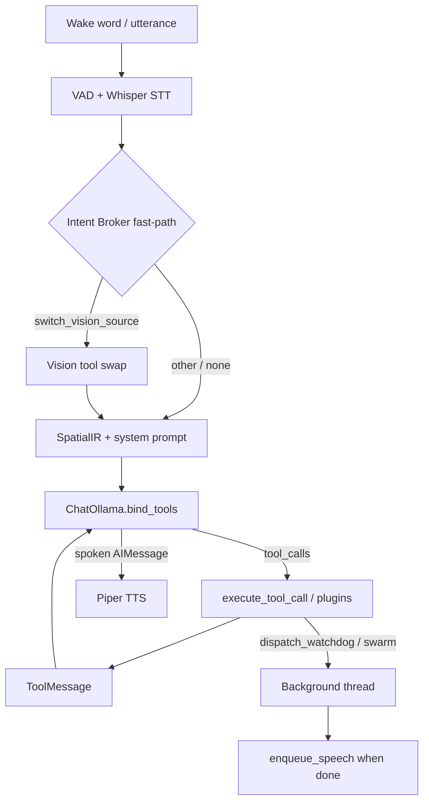

# Donna Architecture

Offline voice agent for CAMGRASPER: wake-word → STT → native LangChain tool calling
(local Ollama) → SecureMemory vault + SpatialIR vision + optional swarms → TTS.

## System overview

| Layer | Role | Key modules |
|-------|------|-------------|
| Perception | YOLO boxes + screen/camera frames | `vision_tools.py`, tracker in `dana/core_agent.py` |
| Spatial compression | Dense `SpatialIR` prompt block | `spatial_context.py` |
| Cognition | Bound-tools loop (≤3 turns) + language lock; MoA think extract | `dana/agentic.py`, `dana/moa_tool_shim.py`, `dana/prompts/spatial_synthesis.py` |
| Routing | RapidFuzz mailroom ≥80% before LLM cascade | `dana/cascade_router.py` |
| Tooling | EN/FA STT aliases + Tool IR + Pydantic guards + LangChain `@tool`s | `dana/tools/`, `dana/tools/guards.py` |
| Memory | Encrypted vault + **SQLite Blackboard** (off-graph history / CoT) | `dana/secure_memory.py`, `dana/vault_service.py`, `dana/memory/blackboard.py` |
| Handoffs | Structured Swarm `Handoff` (deterministic capability switch) | `dana/schema.py`, `dana/handoff.py` |
| Background | Research swarm + Watchdog (Jason-supervised) | `dana/swarm/` |
| Speech | Whisper STT + Piper EN/FA TTS | `dana/core_agent.py` audio workers |
| Paths | Cwd-independent repo root + logs/docs/execution_jail | `dana/paths.py` (`PROJECT_ROOT`) |
| Telemetry | Live Trace queue + JSONL tags | `dana/telemetry.py` → `logs/donna_telemetry.jsonl` |

> **Stage 3 FSM hybrid:** LangGraph state is minimized to `session_id` / `current_agent` / `active_intent`. Full conversational history and DeepSeek `<think>` traces live on `memory/blackboard.db`. See [`docs/architecture.md`](docs/architecture.md).

## Bilingual tool routing

The **Intent Broker** (`dana/tools/broker.py`) maps spoken English into a
language-agnostic `ToolCall` IR for the STT fast-path and argument validation.

1. **Normalize** text (Yeh/Kaf, digits, ZWNJ) via `dana/tools/normalize.py`.
2. **Alias routing** — longest phrase match across EN/FA alias maps in `tools.json`.
3. **Validate / self-correct** — enum coerce, fuzzy tool ids, drop hallucinated args.
4. **Dispatch** — `switch_vision_source` may fast-path; most tools run inside the
   LangChain loop via `dana.core_agent.execute_tool_call`.

LLM tool schemas for the cognitive loop come from `dana/tools/langchain_tools.py`
(`build_langchain_tools` + native tools like `dispatch_watchdog`).

## Cognitive loop (native bind_tools)

`run_react_loop` in `dana/agentic.py`:

```
User query → System (SpatialIR + synthesis guide + protocol)
  → ChatOllama.bind_tools(tools)
  → AIMessage.tool_calls → execute_fn → ToolMessage
  → AIMessage (spoken answer) → Piper TTS
```

- **Cap:** `REACT_MAX_ITERS = 3`.
- **No** manual `TOOL:` / JSON Initiative text parsing in production.
- Recency context (`<visual_context>`, `<memory>`, `<active_watchdogs>`) is appended
  to the latest user message via `format_recency_context_block`.

## Background work

| Tool | Behavior |
|------|----------|
| `dispatch_research_swarm` | Daemon thread → LangGraph research → TTS summary |
| `dispatch_watchdog` | Daemon thread → Donna coder ↔ Jason → sandboxed REPL |
| `kill_watchdog` | Stop a registered Watchdog by ID |
| Episodic log | `docs/watchdog_history.db` via `experience_logger.py` |

Watchdog scripts run with `cwd=execution_jail/` only (filesystem jail). The importable
`dana_security` package is separate — AST/subprocess security + `patch_ledger.md`.

## Request lifecycle



## Verification

| Script | Purpose |
|--------|---------|
| `verify_agentic.py` | Broker + scripted LangChain loop checks |
| `test_langchain_tools.py` | Native tool bridge + Watchdog registry |
| `test_watchdog_graph.py` | Watchdog graph / sandbox cwd |
| `test_e2e_lifecycle.py` | Lifecycle + resource profiling |

## Operational notes

- Settings in `settings.json`: `{mic_id, speaker_id, enable_dynamic_tool_synthesis}`.
- Self-awareness: `read_system_architecture` returns this file + tools schema summary.
- OS typing: production uses real injection; `DONNA_OS_DRY_RUN=1` for debug/E2E.
- Singleton agent lock port `47474`; vault daemon `47475` (or `DONNA_VAULT_PORT`).
