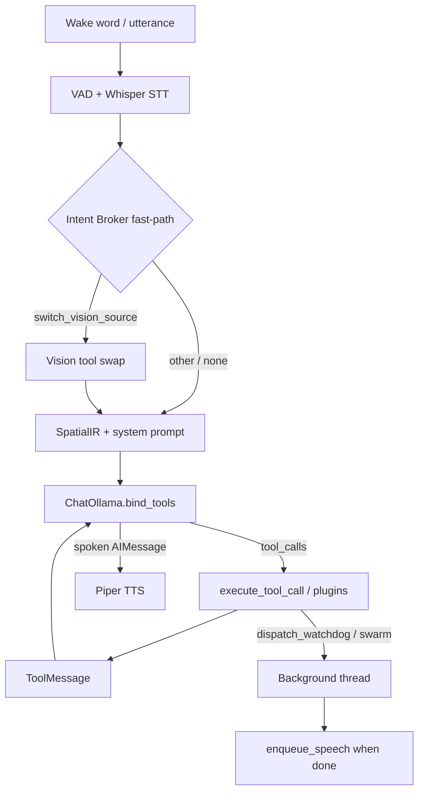

# Dānā Architecture

Offline voice agent for CAMGRASPER: wake-word → STT → native LangChain tool calling
(local Ollama) → SecureMemory vault + hybrid vision grounding + optional swarms → TTS.

**White paper (hardening + OSWorld):** [`docs/WHITE_PAPER.md`](docs/WHITE_PAPER.md)  
**OSWorld bench:** `pytest tests/evals/test_osworld_bench.py`

## Package layout

| Package | Role |
|---------|------|
| `dana/` | Core agent, ReAct graph, vision, memory, tools, UI |
| `dana_jason_loop/` | Jason supervisor / critic loop |
| `dana_security/` | AST/subprocess security gates + `patch_ledger.md` |

## System overview

| Layer | Role | Key modules |
|-------|------|-------------|
| Perception | YOLO boxes + screen/camera frames | `vision_tools.py`, tracker in `dana/core_agent.py` |
| Hybrid grounding | Win32 UIA first → Florence coarse → crop/zoom | `dana/vision/hybrid_grounding.py`, `dana/vision/uia_provider.py` |
| Spatial compression | Dense `SpatialIR` prompt block | `spatial_context.py` |
| Cognition | Bound-tools loop (≤3 turns) + language lock; MoA think extract | `dana/agentic.py`, `dana/moa_tool_shim.py`, `dana/prompts/spatial_synthesis.py` |
| Routing | RapidFuzz mailroom ≥80% before LLM cascade; hydrate → planner supervisor | `dana/cascade_router.py`, `dana/agentic_react_graph.py` |
| Tooling | EN/FA STT aliases + Tool IR + Pydantic guards + LangChain `@tool`s | `dana/tools/`, `dana/tools/guards.py` |
| Shadow exec | Transactional staging under `.dana_scratch/` | `dana/exec/shadow_workspace.py` |
| Self-heal | Critic retries; `FATAL_EXCEPTIONS` → HITL tickets; sub-graph N=2 | `dana/graph/nodes/critic.py`, `dana/graph/subgraph_router.py`, `dana/graph/buffer.py` |
| Memory | Encrypted vault + SQLite Blackboard + episodic TTL/decay | `dana/secure_memory.py`, `dana/memory/blackboard.py`, `dana/memory/compaction.py` |
| Handoffs | Structured Swarm `Handoff` (deterministic capability switch) | `dana/schema.py`, `dana/handoff.py` |
| Background | Research swarm + Watchdog (Jason-supervised) | `dana/swarm/`, `dana_jason_loop/` |
| Speech | Whisper STT + Piper EN/FA TTS via `TTSManager` | `dana/audio/tts_manager.py`, `dana/core_agent.py` audio workers |
| Paths | Cwd-independent repo root + logs/docs/execution_jail | `dana/paths.py` (`PROJECT_ROOT`) |
| Telemetry | Live Trace queue + JSONL tags + Meta-Broker IPC | `dana/telemetry.py`, `dana/graph/meta_broker_process.py` |
| Web (HF) | Gradio headless bridge (no Tkinter) | `app.py`, `dana/web/headless_bridge.py` |
| Security | Importable gates (do not modify casually) | `dana_security/` |

## Headless multi-process architecture (current)

| Feature | Behavior | Module |
|---------|----------|--------|
| **Isolated Meta-Broker** | Epics run in a spawned `multiprocessing.Process`; parent drains a non-blocking Queue (`put_nowait`, drop-on-full) so GUI/headless never deadlocks | `dana/graph/meta_broker_process.py` |
| **IPC telemetry** | Child `child_queue_put` → parent `on_event` → Task Tracker + optional TTS notifications | `emit_meta_broker_telemetry`, `TTSManager.notify` |
| **Zero keep-alive** | `DANA_OLLAMA_KEEP_ALIVE=0` + inter-epic `gc.collect()` reclaim RAM under AST load | `dana/system_health.py`, broker GC hooks |
| **`manifest.json` contract** | AST `ClassDef` + `FunctionDef` exports written to `.dana_scratch/manifest.json` and prepended to the next epic | `dana/graph/artifact_manifest.py` |
| **Stdlib-first codegen** | Worker / broker / supervisor prompts require Python stdlib unless the prompt requests third-party packages | `META_BROKER_STDLIB_RULE` |
| **TTSManager** | One `speech_queue`, one daemon Piper consumer — sequential system-wide voice | `dana/audio/tts_manager.py` |
| **Gradio HF Space** | `app.py` submits via `HeadlessBrokerBridge` (background thread + poll/stream) | `dana/web/headless_bridge.py` |

Headless boot: `python run.py --no-gui` sets `DANA_NO_GUI` / `DANA_HEADLESS` and starts `start_headless_telemetry_drainer`.

> **Stage 3 FSM hybrid:** LangGraph state is minimized to `session_id` / `current_agent` / `active_intent`. Full conversational history and DeepSeek `<think>` traces live on `memory/blackboard.db`. See [`docs/architecture.md`](docs/architecture.md).

## Five hardened capabilities (production)

1. **Transactional Shadow Workspaces** — stage under `.dana_scratch/<session_id>/`; commit on `exit_code == 0`, else rollback.
2. **Fatal Error Classification** — `FATAL_EXCEPTIONS` bypass Critic and draft HITL tickets.
3. **Hybrid Win32 UIA + Crop-and-Zoom Florence-2** — UIA first; 15% pad + 2× upscale if edge &lt; 30 (1000-space).
4. **Zero-Copy State Buffer & Sub-Graph Retries** — full traces in `raw_state_buffer`; local retries N=2 before supervisor escalate.
5. **Memory Compaction** — spatial TTL **900s**; exponential decay \(W = W_0\exp(-0.05\cdot\Delta h)\).

## Bilingual tool routing

The **Intent Broker** (`dana/tools/broker.py`) maps spoken English into a
language-agnostic `ToolCall` IR for the STT fast-path and argument validation.

1. **Normalize** text (Yeh/Kaf, digits, ZWNJ) via `dana/tools/normalize.py`.
2. **Alias routing** — longest phrase match across EN/FA alias maps in `tools.json`.
3. **Validate / self-correct** — enum coerce, fuzzy tool ids, drop hallucinated args.
4. **Dispatch** — `switch_vision_source` may fast-path; most tools run inside the
   LangChain loop via `dana.core_agent.execute_tool_call`.

LLM tool schemas for the cognitive loop come from `dana/tools/langchain_tools.py`
(`build_langchain_tools` + native tools like `dispatch_watchdog`).

## Cognitive loop (native bind_tools)

`run_react_loop` in `dana/agentic.py`:

```
User query → System (SpatialIR + synthesis guide + protocol)
  → ChatOllama.bind_tools(tools)
  → AIMessage.tool_calls → execute_fn → ToolMessage
  → AIMessage (spoken answer) → Piper TTS
```

- **Cap:** `REACT_MAX_ITERS = 3`.
- **No** manual `TOOL:` / JSON Initiative text parsing in production.
- Recency context (`<visual_context>`, `<memory>`, `<active_watchdogs>`) is appended
  to the latest user message via `format_recency_context_block`.

Production ReAct corridor entry: `START → hydrate_memory → planner → executor → agent`
(`compile_dana_react_graph` in `dana/agentic_react_graph.py`).

## Background work

| Tool | Behavior |
|------|----------|
| `dispatch_research_swarm` | Daemon thread → LangGraph research → TTS summary |
| `dispatch_watchdog` | Daemon thread → Dana coder ↔ Jason → sandboxed REPL |
| `kill_watchdog` | Stop a registered Watchdog by ID |
| Episodic log | `docs/watchdog_history.db` via `experience_logger.py` |

Watchdog scripts run with `cwd=execution_jail/` only (filesystem jail). The importable
`dana_security` package is separate — AST/subprocess security + `patch_ledger.md`.

## Request lifecycle



## Verification

| Script | Purpose |
|--------|---------|
| `scripts/diagnostics/verify_agentic.py` | Broker + scripted LangChain loop checks |
| `test_langchain_tools.py` | Native tool bridge + Watchdog registry |
| `test_watchdog_graph.py` | Watchdog graph / sandbox cwd |
| `test_e2e_lifecycle.py` | Lifecycle + resource profiling |
| `tests/evals/test_osworld_bench.py` | Adversarial OSWorld-style offline bench |

## Operational notes

- Settings in `settings.json`: `{mic_id, speaker_id, enable_dynamic_tool_synthesis}`.
- Self-awareness: `read_system_architecture` returns this file + tools schema summary.
- OS typing: production uses real injection; `DANA_OS_DRY_RUN=1` for debug/E2E.
- Singleton agent lock port `47474`; vault daemon `47475` (or `DANA_VAULT_PORT`).
