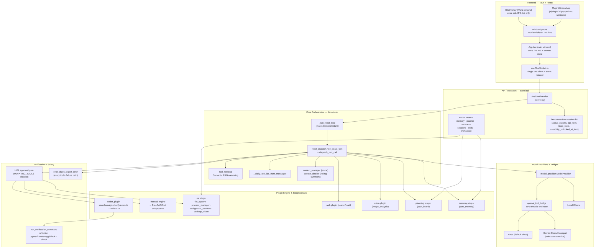
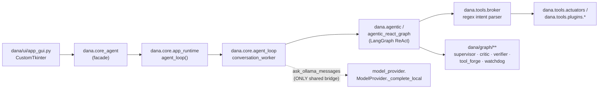
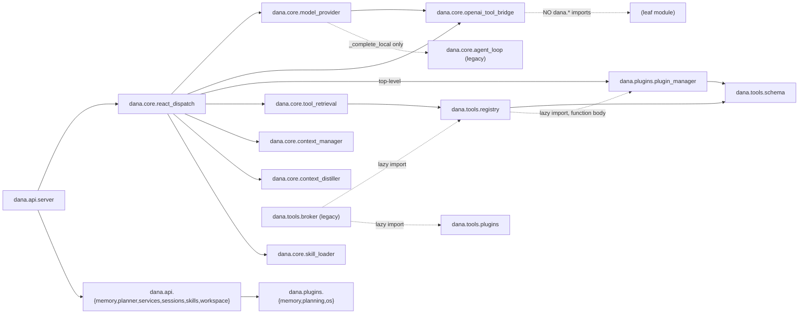

# Dana System Architecture Audit

**Scope:** Full repository — Python backend (`dana/`), Tauri/React frontend (`frontend/`), tool registry/plugins, test suite, and configuration.
**Method:** Direct inspection (this session's own prior work on `dana/core/react_dispatch.py`, `model_provider.py`, `openai_tool_bridge.py`, `coder_plugin`, `error_digest.py`) plus four parallel research passes covering `dana/core`+`dana/api`, `dana/plugins`+`dana/tools`, `frontend/**`, and tests/dead-code/circular-imports.

**The single most important finding, up front:** this repository contains **two architecturally separate, both fully live, production systems**, not one system with dead legacy cruft:

1. **The current stack** — Tauri + React frontend ↔ FastAPI/WebSocket backend (`dana/api/server.py`) ↔ the ReAct dispatcher (`dana/core/react_dispatch.py`) ↔ cloud/local LLM bridge ↔ plugins. This is the stack every prior task this session modified, and the one `scripts/launchers/start_dana.bat` boots by default.
2. **The legacy stack** — a CustomTkinter always-listening voice assistant (`dana/ui/app_gui.py` → `dana.core_agent` → `dana.core.app_runtime`/`agent_loop.py`) driven by a LangGraph implementation (`dana/agentic_react_graph.py`, `dana/agentic.py`) and a bilingual regex intent broker (`dana/tools/broker.py`), with its own swarm/supervisor/critic/watchdog subsystem (`dana/graph/`, `dana/swarm/`). This is **not dead** — it has ~90 dedicated test files, its own entry point, and `dana/__init__.py`'s own docstring still documents it as the canonical import pattern.

The two stacks share almost no code. The **only confirmed bridge point** is `dana.core.model_provider.ModelProvider._complete_local`, which calls `dana.core.agent_loop.ask_ollama_messages`. Sections 3 and 4 cover both stacks; the roadmap in Section 5 targets the current (live chat) stack, since that's where this session's work has concentrated.

---

## 1. Executive System Topology & Dataflow Architecture

### 1.1 High-level topology — the current stack

### 1.2 The parallel legacy stack (not shown to scale above — see §3.9)

### 1.3 End-to-end execution trace (current stack, text turn)

1. **User input** — `ChatPanel.tsx` collects text (+ optional image attachments, capped client-side at 4 images / 1024px) and calls `onSend`, wired in `App.tsx` to `useChatSocket`'s send function, which serializes `{text, attachments?, include_desktop_context?}` over the open `/ws/chat` WebSocket.
2. **Transport** — `server.py`'s `ws_chat` receive loop (no `type` field ⇒ falls through to the plain-chat branch) appends a user message to the session's `messages` list, persists it (`sessions.save_session`), and starts `_run_react_loop`.
3. **Capability check** — `_effective_capabilities(session)` unions the frontend's explicit `active_plugins` (from `update_context`) with anything unlocked-and-not-yet-decayed via `load_capability` (`capability_unlocked_at_turn`, 4-turn decay).
4. **Prompt + tool-set build** — `react_dispatch.build_system_prompt` assembles the domain-agnostic core prompt (or the frozen FreeCAD prompt if that domain is active), core-memory block, mounted-directories block, working-memory summary, and active-plan block. `_llm_tools_schema` resolves the capability-gated tool-id set, then **Semantic RAG narrowing** (`tool_retrieval.narrow_tool_ids_by_query`, only above 8 candidate tools) trims it to the top-K most relevant to the turn's text — with `_sticky_tool_ids_from_messages` forcibly re-including any tool already invoked THIS chain, or any tool a `load_capability` call already unlocked (reading its own `unlocked_tools` result field) — so a just-unlocked tool can never be narrowed back out before it's ever used.
5. **Tool retrieval / model call** — `_call_llm_once` prunes image history (`context_manager.prune_message_history`), resolves `tool_calling_provider()` (Ollama by default, or Groq/Gemini-OpenAI-compat when `DANA_CLOUD_PRIMARY` is set), and calls `ModelProvider.complete_with_tool_calls` → `openai_tool_bridge.complete_openai_with_tools`, which streams the response and — on a confirmed Groq TPM 429 — sleeps the provider's own advertised retry-after (capped, ≤45s) and retries the identical request against the identical model, up to twice, before degrading to a synthesized "rate limit reached" reply. The whole call is capped at 60s (`_LOCAL_TOOL_CALL_TIMEOUT_SEC`, deliberately kept above the TPM sleep ceiling).
6. **Decision** — the model either replies with plain text (`turn.kind == "final"`) or proposes exactly one tool call (`turn.kind == "tool_call"`; the system prompt enforces "one tool call per turn").
7. **HITL gate** — if the proposed tool is in `MUTATING_TOOLS` (e.g. `execute_code_task`, `write_file`, `execute_terminal_command`), the loop suspends: `session["react_state"]` stashes everything needed to resume, the frontend gets a `hitl_approval_required` WS message, and the loop only continues once a human sends back `hitl_response`. Read-only tools (`search_codebase`, `analyze_codebase`, `run_verification_command`, `check_plugin_registry`, …) dispatch immediately with no human in the loop.
8. **Dispatch** — `dispatch_tool_call` looks up the handler in `TOOL_HANDLERS`, calls it, and on failure funnels the result through `error_digest.digest_error` — collapsing the payload to a structured `{status, reason, suggestion, raw_error}` shape (max 400 chars) so a subprocess's stdout/stderr never blows the context, while still preserving the actionable tail of the output.
9. **Verification loop (software_engineering domain)** — the system prompt enforces a strict pipeline: `search_codebase` (git grep, locate) → `analyze_codebase` (read only what matched) → `execute_code_task` (Aider, HITL-gated, `--edit-format diff`) → `run_verification_command` (pytest/flake8/mypy/black --check, read-only). On a verification failure, the model is instructed to immediately call `execute_code_task` again with the traceback pasted into `task_description`, repeating Edit→Verify until it passes or the same error repeats twice.
10. **Loop continuation** — the tool result is appended as a `tool` role message and the loop recurses into step 4 with the growing `messages` history, up to `_MAX_REACT_ITERATIONS = 13` per user turn.
11. **UI streaming** — every step along the way emits WS events (`tool_start`/`tool_complete`, `tool_call`/`tool_result`, `dag_node_start`/`dag_node_complete`, `camera_animate` for CAD) that `useChatSocket` folds into `App.tsx`'s live Agent Activity feed, DAG Monitor, and (for FreeCAD) the 3D viewport.
12. **Turn end** — a `"final"` turn appends `assistant_message`, persists the session, and (if voice is active) synthesizes/streams `assistant_audio`.

### 1.4 Side channels
- **Voice:** `voice_control` (`listen`/`cancel`) → `VoiceService` captures/transcribes → becomes a normal chat turn; `voice_state`/`assistant_audio` stream back.
- **Visual capture:** a tool needing a live screenshot (e.g. FreeCAD's canvas) suspends the loop with `visual_capture_request`; the frontend's R3F canvas replies with `visual_capture_response`, resolved by `_resolve_visual_capture`.
- **Abort:** `abort_turn` sets `session["abort_requested"]`, checked at the top of every loop iteration and immediately after `next_react_turn` returns — ends the turn with a clean "Generation aborted by user" reply rather than a crash.
- **Dynamic Workspace Mounting:** `POST /api/workspace/mount` persists an externally-granted directory to `data/mounts.json`, re-read fresh every ReAct turn (no cache) so every connected session sees the same grants.

---

## 2. Constants, Configuration & Magic Numbers Ledger

### 2.1 Model & Token Limits

| Constant | File:Line | Value | Purpose | Fragility |
|---|---|---|---|---|
| `_MIN_TOOLS_TO_NARROW` | `dana/core/tool_retrieval.py:33` | `8` | RAG narrowing only engages above this many candidate tools | Below this, narrowing is a silent no-op — core tools alone (10) already exceed it |
| `_DEFAULT_TOP_K` | `dana/core/tool_retrieval.py:35` | `6` | Tools kept after narrowing (env-overridable `DANA_TOOL_RAG_TOP_K`) | A too-small K plus a weak embedding match can starve a legitimately-needed tool if it's not `sticky` |
| `_EMBED_DIM` | `dana/tools/registry.py:32` | `384` | Hash-embedding vector width | `hash_embed` is a deterministic bag-of-tokens/bigram hash, **not a real semantic model** — literal token overlap drives retrieval quality |
| `_DEFAULT_GATEWAY_URL` / `_DEFAULT_GATEWAY_MODEL` | `dana/core/model_provider.py` | `"http://localhost:8000/v1"` / `"cascade-auto"` | Local Cascade-Router gateway endpoint/model (env-overridable `LLM_GATEWAY_URL`/`DANA_GATEWAY_MODEL`) | Now `tool_calling_provider()`'s default cloud provider — the gateway itself cascades groq -> gemini -> openai on 429/5xx, so `openai_tool_bridge`'s own client-side TPM sleep/retry loop (formerly `_MAX_TPM_RETRIES`/`_MAX_REASONABLE_RETRY_AFTER_SEC`) was removed |
| Groq default model | `dana/core/model_provider.py:337` | `"llama-3.3-70b-versatile"` | Fallback if `DANA_GROQ_MODEL` unset (only reached when `DANA_CLOUD_PROVIDER=groq` bypasses the gateway) | Live deployments observed using `openai/gpt-oss-120b` via env override — the code default and the real default have drifted |
| Gemini OpenAI-compat model | `dana/core/model_provider.py` (`_resolve_openai_endpoint`) | `"gemini-3.6-flash"` | Default when `provider == "gemini_openai"` | Endpoint has a known `thought_signature` 400 bug mid-multi-turn — hence Groq is the default provider again |
| Gemini OpenAI-compat base URL | `dana/core/model_provider.py` | `"https://generativelanguage.googleapis.com/v1beta/openai/"` | — | overridable via `GEMINI_API_BASE` |
| Aider model | `dana/plugins/coder_plugin/engine.py:354` | `"gemini/gemini-3.6-flash"` | Aider's own model choice — **native Gemini API, bypasses `openai_tool_bridge` entirely** | This is the actual "hybrid architecture": orchestrator on Groq, heavy edits natively on Gemini |
| `_DEFAULT_LOCAL_MODEL` | `dana/core/model_provider.py:21`, duplicated in `context_distiller.py`, `agentic_react_graph.py` area | `"qwen2.5-coder:7b"` | Local Ollama fallback model | Same literal hand-copied into ≥3 files — a model rename requires 3 edits |
| `_FALLBACK_LOCAL_MODEL` | `dana/core/react_dispatch.py:2163` | `"llama3.2"` | Model asked for a plain apology after a primary-call timeout | Fails silently-uselessly if not `ollama pull`ed locally |
| Ollama base URL | 5 separate places (`cascade_router.py`, `model_provider.py`, `tools/os_control.py`, `agentic.py`, `core/constants.py`) | `"http://127.0.0.1:11434"` | Local Ollama endpoint | Only `constants.py`'s `OLLAMA_URL` is canonical; the other 4 are ad hoc duplicate fallbacks |

### 2.2 Timeouts & Throttles

| Constant | File:Line | Value | Purpose | Fragility |
|---|---|---|---|---|
| `_LOCAL_TOOL_CALL_TIMEOUT_SEC` | `dana/core/react_dispatch.py` | `30.0` | Hard ceiling on one primary LLM turn | Was briefly derived from `openai_tool_bridge`'s `_MAX_REASONABLE_RETRY_AFTER_SEC` (to avoid aborting mid-sleep during a Groq TPM throttle); reset to a fixed value now that cloud tool-calling routes through the Cascade-Router gateway and that sleep/retry loop no longer exists — a 429/5xx now fails fast instead |
| `_FALLBACK_TIMEOUT_SEC` | `react_dispatch.py:2156` | `10.0` | Ceiling on the "primary model timed out" apology call | — |
| `_MAX_REACT_ITERATIONS` | `dana/api/server.py:444` | `13` | Hard cap on tool-chaining steps per user turn | `scripts/run_kobayashi_maru.py:286`'s comment says `5` — **stale duplicated literal**, drift risk between doc-comment and real value |
| `_SUSPENDED_TURN_TIMEOUT_SEC` | `server.py:455` | `60.0` | Auto-cancel a stuck HITL/visual suspension | — |
| `_SUSPENSION_SWEEP_INTERVAL_SEC` | `server.py:460` | `15.0` | Poll interval for the sweep loop | — |
| `_CAPABILITY_DECAY_TURNS` | `server.py:127` | `4` | Turns before an autonomously-unlocked capability domain drops out of the schema | Raising it re-grows prompt-eval time; lowering risks mid-task capability loss |
| `_SEARCH_TIMEOUT_S` / `_ANALYZE_TIMEOUT_S` | `coder_plugin/engine.py:57-58` | `20.0s` each | `git grep` / file-read ceiling | — |
| `_EXECUTE_TIMEOUT_S` | `coder_plugin/engine.py:62` | `180.0s` | Aider subprocess ceiling | Comment admits 20-30s observed even for trivial tasks; a larger task could still exceed this |
| `_VERIFY_TIMEOUT_S` | `coder_plugin/engine.py:66` | `120.0s` | `run_verification_command` ceiling | Deliberately NOT sized to cover this repo's own full suite (multi-minute) |
| `_DEFAULT_TIMEOUT_S` (FreeCAD) | `freecad/engine.py:46` | `60.0s` | Every FreeCADCmd subprocess op | One global timeout regardless of geometry complexity |
| `_DEFAULT_TIMEOUT_S` / `_TERMINAL_DEFAULT_TIMEOUT_S` (os_tools) | `os/process_manager.py:44-45` | `10.0s` / `15.0s` | `run_python_script` / `execute_terminal_command` | Not model-controllable by design — the real safety boundary is the HITL gate, not the timeout |
| `_STOP_TIMEOUT_S` | `os/background_services.py:60` | `10.0s` | Wait for a killed service to actually die | A hung process can still leave `stop_background_service` erroring after 10s |
| `_DISTILL_TIMEOUT_SEC` | `core/context_distiller.py:53` | `20.0s` | Ceiling on background working-memory summarization | Runs on local GPU, off the cloud hot path |
| `DEFAULT_TIMEOUT_SEC` / `DEFAULT_PYTHON_TIMEOUT_SEC` (legacy) | `dana/tools/actuators.py:22-23` | `15` / `300` | Legacy broker-stack shell/python timeouts | A **third**, independent timeout philosophy for "run a command," alongside `process_manager.py`'s and `coder_plugin`'s own |
| `SANDBOX_JOB_TTL_S` (legacy) | `dana/tools/actuators.py:24` | `3600` | Legacy jailed-Python job TTL | — |
| `_DEV_ORIGINS` CORS list | `server.py:75-82` | 6 hardcoded origins | Vite/Tauri dev CORS allowlist | A packaged production build pointing elsewhere is silently blocked unless updated in lockstep |
| WS reconnect | `frontend/src/lib/useChatSocket.ts:201` | *(none — `onclose` just sets state)* | — | **Absence** of any retry/backoff is itself notable: a dropped connection is never auto-recovered |

### 2.3 Network & Server Settings

| Constant | File:Line | Value | Purpose | Fragility |
|---|---|---|---|---|
| `DEFAULT_HOST` / `DEFAULT_PORT` | `scripts/launchers/launch_api_server.py:23-24` | `"127.0.0.1"` / `8000` | FastAPI/Uvicorn bind | Frontend's CSP (`src-tauri/tauri.conf.json`) and `apiBase.ts`'s dev fallback both hardcode `localhost:8000` independently — three separate places that must agree |
| CSP `connect-src` | `frontend/src-tauri/tauri.conf.json:38` | `ws://localhost:8000 http://localhost:8000` | Locks the webview to the local backend origin | Blocks any `VITE_API_BASE` override pointing elsewhere unless the CSP is updated too |
| dev API fallback | `frontend/src/lib/apiBase.ts:16` | `http://localhost:8000` | Dev/Tauri-mode backend origin | Overridable only via `VITE_API_BASE` |
| `DEV_PORTS` | `apiBase.ts:8` | `{1420, 5173}` | Detects Vite dev server vs. packaged app | Hardcoded Vite/Tauri port list |
| Main/orb window geometry | `src-tauri/tauri.conf.json:17-35` | main `1280×800` (min `900×600`); orb `140×140`, always-on-top, no taskbar | Initial window sizing | Not persisted across launches |
| `_SINGLETON_PORT` (legacy) | `dana/core/app_runtime.py:106` | `47474` | Loopback mutex — one-instance guard | Legacy launcher only; collides if another local process binds it |
| Daemon sidecar host/port | `dana/daemon/engine.py:26-27` and independently `dana/ui/daemon_client.py:20-21` | `"127.0.0.1"` / `50051` | Agent Engine sidecar IPC | **Duplicated literal** — client doesn't import the server's constant |
| Vault daemon port | `dana/vault_service.py:87,313-320` | `"127.0.0.1"` / `47475` | Encrypted-key daemon IPC | — |
| `LOG_POLL_INTERVAL_MS` (frontend) | `plugins/ServicesPlugin.tsx:12` | `3000` | Poll a selected service's log | No backoff/jitter |
| `POLL_INTERVAL_MS` (frontend) | `plugins/PlannerPlugin.tsx:15` | `3000` | Poll `/api/planner` | Runs unconditionally for the plugin's whole mounted lifetime — explicitly a stand-in for a not-yet-built WS event |

### 2.4 Sandbox & Safety Constraints

| Constant | File:Line | Value | Purpose | Fragility |
|---|---|---|---|---|
| `_ALLOWED_VERIFY_COMMANDS` | `coder_plugin/engine.py:83-91` | `{pytest, flake8, mypy, black:("--check",)}` | **Entire** safety boundary of `run_verification_command` | Hardcoded — adding a verification tool requires a code change, not config |
| `_ERROR_TAIL_CHARS` | `coder_plugin/engine.py:132` | `400` | Tail-truncation so the LLM sees the actionable end of a failure, not collection noise | Tuned to match `error_digest`'s own 400-char clip — the two must be changed together |
| `_RAW_ERROR_MAX_CHARS` | `freecad/error_digest.py:23` | `400` | Truncates raw error text shown to the LLM | Shared assumption with the constant above |
| Timeout misclassification regex | `freecad/error_digest.py:76` | `(?=.*freecad)(?=.*timed out)` | **Fixed this session** — used to match ANY tool's timeout and mislabel it "The FreeCAD subprocess did not finish..." | Now requires literal co-occurrence with "freecad" |
| `_DENYLISTED_RELATIVE_PARTS` | `coder_plugin/engine.py` | `{".env", ".git"}` | Never-reachable paths even after HITL approval | — |
| `MUTATING_TOOLS` | `react_dispatch.py:1083` | ~20 tool ids | HITL-gating allowlist | A new mutating tool omitted here silently skips human approval — **highest-severity fragility in the whole ledger** |
| `_TOOLS_NEEDING_API_KEYS` / `_TOOLS_NEEDING_MOUNTS` | `react_dispatch.py:2686,2696` | 2 / 7 tool ids | Which handlers get BYOK keys / workspace mounts injected | Same class of omission risk as `MUTATING_TOOLS` |
| `_ALIAS_PATTERN` | `os/background_services.py:54` | `^[A-Za-z0-9_.-]+$` | Service-alias charset — doubles as a path/shell-injection guard | Correct today; any future reuse of alias as a raw shell arg must re-derive this guarantee independently |
| `_MAX_SEARCHABLE_FILE_BYTES` | `os/file_system.py:255` | `2 MB` | `search_files` per-file cap | — |
| `_MAX_WIDTH` / `_JPEG_QUALITY` | `os/desktop_vision.py:31,43` | `1920px` / `85` | Screenshot downscale before VLM upload | "HIGH-PRIVACY action" — deliberately in `MUTATING_TOOLS` for consent, not just because it mutates |
| `RAM_THRESHOLD_PERCENT` | `dana/system_health.py:15` | `92.0` | Global RAM% abort ceiling | Fixed percentage, ignores machine size or current workload |
| `llm_lock` | `system_health.py:12` | `threading.RLock()` | Serializes every LOCAL LLM generation process-wide | Single global contention point; cloud calls deliberately bypass it |
| `MEMORY_SALT` / `PBKDF2_ITERATIONS` | `core/shared_state.py:221-222` | hardcoded salt / `390_000` | — | **Confirmed dead** — zero references anywhere else in the repo |

---

## 3. Comprehensive Folder-by-Folder Inventory

Scoping note: the **live/current stack** (`dana/core`, `dana/api`, `dana/plugins`, `dana/tools`, `frontend/`) gets full per-file breakdowns below. The **legacy voice-agent stack** (`dana/graph`, `dana/swarm`, `dana/memory`, `dana/ui`, `dana/audio`, and the dozens of top-level `dana/*.py` modules feeding `dana.tools.broker`) is covered at directory level with representative files — it is large (~150+ files), fully live, and out of scope for the deep-dive this session's work targeted, but no directory is skipped.

### 3.1 `dana/core/` — ReAct orchestration (live) + legacy voice loop

| File | Responsibility | Upstream callers | Lifecycle |
|---|---|---|---|
| `react_dispatch.py` (2926 lines) | System-prompt construction, capability routing (`_CAPABILITY_TOOL_IDS`), Semantic RAG narrowing wiring, sticky-tool tracking, `TOOL_HANDLERS` dispatch table (~90 native + manifest tools), `digest_error` failure funneling, timeout+fallback | `dana/api/server.py`, `dana/api/skills.py`, most of `tests/core/`, `tests/api/` | App Startup (`refresh_plugin_tools`/`refresh_user_skills` at import) + WS Event (every turn) |
| `model_provider.py` | `ModelProvider` — local/cloud routing, `tool_calling_provider()`, `_resolve_openai_endpoint()` (groq/gemini_openai/ollama/openai key+base+model resolution), local↔cloud complexity fallback | `react_dispatch.py`, `dana/plugins/os/desktop_vision.py`, `dana/plugins/vision/image_analysis.py` | Dynamic ReAct Tool Call (constructed per turn) |
| `openai_tool_bridge.py` | Pure OpenAI-wire HTTP bridge (streamed `/chat/completions`), Groq TPM-429 throttle-and-retry loop, degraded-summary fallback, Ollama-quirk tool-call recovery from plain-text content | `model_provider.py` | Dynamic ReAct Tool Call; **zero `dana.*` imports** — a genuine leaf module |
| `tool_retrieval.py` | Semantic RAG narrowing (`narrow_tool_ids_by_query`) — Pillar 1 of the token-compression architecture | `react_dispatch.py` | Dynamic ReAct Tool Call |
| `context_manager.py` | `prune_message_history` — replaces stale image attachments with lightweight placeholders | `react_dispatch._call_llm_once` | Dynamic ReAct Tool Call |
| `context_distiller.py` | Local-GPU rolling working-memory summarization (Pillar 3) | `server.py` (per-turn, off the cloud hot path) | Background Thread |
| `skill_loader.py` | Autonomous Skill Acquisition — `save_new_skill`/`delete_skill`/`read_skill_source`, hot-reloads into `_CAPABILITY_TOOL_IDS["user_skills"]` | `react_dispatch.py`, `dana/api/skills.py` | Dynamic ReAct Tool Call |
| `constants.py` | Central audio/vision/VAD tunable table (sample rate, wake-word thresholds, barge-in RMS, TTS chunk size) — the one place in the repo that already centralizes magic numbers with inline rationale | Legacy audio stack, `agent_loop.py` | App Startup (module constants) |
| `telemetry.py` | Ring-buffer telemetry (`DASHBOARD_INTERVAL_SEC=45.0`) | Legacy dashboard | Background Thread |
| `command_classifiers.py` | Legacy heuristic intent classifiers | `agent_loop.py`/`broker.py` | Dynamic (legacy) |
| `agent_loop.py` (2898 lines) | **Legacy** always-listening conversation worker — ~45 `_handle_*` tool-dispatch closures, `ask_ollama_messages` (the one function `model_provider.py` still calls) | `app_runtime.py`, `model_provider._complete_local` | Legacy entry point only |
| `app_runtime.py` (1210 lines) | **Legacy** boot sequence — starts mic/wakeword/TTS threads, singleton-port guard (`47474`) | `dana.core_agent` | Legacy entry point only |
| `shared_state.py` | **Legacy** cross-thread globals (history window, spatial memory TTL, mic device guards); also hosts the confirmed-dead `MEMORY_SALT`/`PBKDF2_ITERATIONS` | `agent_loop.py`, `dana/vision/tracker_worker.py` | Legacy only |

### 3.2 `dana/api/` — FastAPI/WebSocket backend (100% new code, no legacy heritage)

| File | Responsibility | Upstream callers | Lifecycle |
|---|---|---|---|
| `server.py` (1230 lines) | The single entry point — `/ws/chat`, `_run_react_loop`, HITL suspend/resume, voice wiring, capability decay, mounts all 6 REST routers, static-frontend serving | `scripts/launchers/launch_api_server.py` (`uvicorn.run("dana.api.server:app")`), `tests/api/*` | App Startup + WS Event + Background Thread (`_sweep_stale_suspensions`) |
| `memory.py` | `GET`/`POST /api/memory` → `dana.plugins.memory.core_memory` | `server.py` only | REST endpoint |
| `planner.py` | Read-only `GET /api/planner` → `dana.plugins.planning.task_board` | `server.py` only | REST endpoint |
| `services.py` | `GET/DELETE /api/services*` → `dana.plugins.os.background_services` | `server.py` only | REST endpoint |
| `sessions.py` | Chat-session JSON persistence (`AGENT_WORKSPACE_DIR/data/sessions/*.json`) | `server.py`, `tests/conftest.py` | App Startup + Dynamic (every completed turn) |
| `skills.py` | `GET/DELETE/PUT /api/skills` mirroring `react_dispatch.list_user_skills()` | `server.py` only | REST endpoint |
| `workspace.py` | Read-only file-tree/content + Dynamic Workspace Mounting (`data/mounts.json`) | `server.py` only | REST endpoint + Dynamic (mounts re-read every turn) |

### 3.3 `dana/plugins/` — mixed manifest-driven + hand-wired capability modules

Only `coder_plugin/` and `freecad/` ship a `manifest.json`; `os/`, `web/`, `vision/`, `planning/`, `memory/` are hand-wired into `react_dispatch.TOOL_HANDLERS` via `_tool_*` wrappers.

| File | Responsibility | Lifecycle | Note |
|---|---|---|---|
| `plugin_manager.py` | Zero-touch manifest.json auto-discovery (`discover_plugin_dirs`, `load_all_plugins[_grouped]`) | App Startup | **Zero test coverage** anywhere in `tests/` despite being a hub module |
| `coder_plugin/engine.py` + `manifest.json` | `search_codebase`, `analyze_codebase`, `run_verification_command`, `execute_code_task` — the `software_engineering` domain | Dynamic ReAct Tool Call | Fully live; domain name has no collision |
| `freecad/engine.py` (1985 lines) | ~24 CAD operator functions via `FreeCADCmd` subprocess | Dynamic ReAct Tool Call (20+ via native wrappers) | **`freecad/manifest.json`'s 5 declared tools are dead weight for the live loop** — see §4.3 |
| `freecad/error_digest.py` | `digest_error` — runs for **every** tool's failure, any domain | Dynamic (every failed call) | Shared infrastructure hiding in a domain-named folder |
| `freecad/call_log.py`, `py_export.py`, `techdraw_export.py`, `standard_parts.py`, `engineering_standards.py` | Call history / "Show Your Work" macro export / 2D blueprints / standard-hardware generation / dimension lookup | Dynamic ReAct Tool Call | `py_export.py`'s `_STEP_BUILDERS` is a hand-maintained, narrower duplicate of `TOOL_HANDLERS` — a forgotten sync point |
| `os/file_system.py` | Sandboxed `list_directory`/`read_file`/`write_file`/`edit_file`/`search_files` | Dynamic ReAct Tool Call | `write_file`/`edit_file` in `MUTATING_TOOLS` |
| `os/process_manager.py` | `run_python_script` (fixed argv) / `execute_terminal_command` (arbitrary shell, HITL-gated) | Dynamic ReAct Tool Call | |
| `os/background_services.py` | Start/stop/list long-running dev processes, process-group kill | Dynamic ReAct Tool Call | State is in-memory (`_ACTIVE_PROCESSES`), cleared on restart |
| `os/desktop_vision.py` | `analyze_desktop_screen` — primary-monitor capture + VLM | Dynamic ReAct Tool Call | Privacy-mutating by design |
| `web/research.py` | `search_web` (DDGS) / `read_webpage` (httpx+BS4) | Dynamic ReAct Tool Call | Deliberately different ids than `tools.json`'s legacy `web_search`/`fetch_webpage` — **two parallel web-search implementations exist system-wide** |
| `vision/image_analysis.py` | `analyze_workspace_image` — sandboxed image + VLM | Dynamic ReAct Tool Call | |
| `planning/task_board.py` | `create_plan`/`mark_task_completed`/`get_active_plan` — global in-memory executive-function scratchpad | Dynamic ReAct Tool Call + `GET /api/planner` | Not persisted across restarts |
| `memory/core_memory.py` | Persistent on-disk Core Memory read/write/replace | Dynamic ReAct Tool Call + `GET/POST /api/memory` + every system-prompt build | |

### 3.4 `dana/tools/` — shared substrate for BOTH stacks

| File | Responsibility | Note |
|---|---|---|
| `schema.py` | `ToolSpec`/`ToolParameterSpec`/`ToolCall` IR, `tools.json` loader, OpenAI function-schema builder | Consumed by both stacks |
| `registry.py` | `ToolRegistry` (O(1) dispatch + `_VectorIndex`), `hash_embed`, disk hot-loading for `general/`/`custom/` tools | App Startup singleton |
| `schema_minify.py` | "Pillar 2" — condenses tool description prose to ≤140 chars before it hits the wire | **Call site not confirmed** in this pass — flagged for a follow-up grep; also zero test coverage |
| `tools.json` | Master bilingual tool declaration file | Loaded once by `load_tool_registry` |
| `actuators.py` | Legacy `write_to_file`/`execute_command` + jailed Python sandbox jobs | Legacy stack only |
| `broker.py` (2181 lines) | Legacy bilingual regex intent parser → `ToolCall` IR | 57 files reference it directly — very much alive, legacy-stack-only |
| `general/` | Permanent hot-loaded tools (`draft_cursor_prompt.py`, `github_issue_reporter.py`) | App Startup disk-load, shared registry |
| `custom/__init__.py` | Self-documented **dead** legacy mirror — "do not add new tools here" | Confirmed dead by its own docstring |
| `dynamic/generated_tools.py` | Inert placeholder — dynamic tool synthesis is feature-flagged off by default | Dead-by-design, not accidental |
| `plugins/__init__.py` + 4 files | A **third** plugin-registration mechanism (`_PLUGIN_HANDLERS` allowlist) | Reachable only from `broker.py` — legacy stack only |

### 3.5 `dana/platform/`, `dana/services/`, `dana/audio/`

- **`dana/platform/`** — `factory.py` (env-driven driver selection), `base.py` (abstract control-plane), `win32.py` (real Windows window-management, `_CAD_WINDOW_HINTS`), `mock.py` (trimesh-backed fake CAD engine for tests/headless), `darwin.py` (deliberate `NotImplementedError` stub). Used by both stacks; `mock.py` backs `tests/platform/test_mock_cad_engine.py`.
- **`dana/services/voice_service.py`** — the current stack's own voice capture/VAD/TTS service (`_LISTEN_CHUNK_S=0.5`, `_MAX_UTTERANCE_S=8.0`, `_SILENCE_HANGOVER_S=0.8`), wired into `server.py`'s lifespan. Independent of the legacy audio pipeline below.
- **`dana/audio/`** (13 files, legacy stack) — `mic_input.py`, `wakeword_worker.py`, `wake_poller.py`, `vad_consumer.py`, `noise_floor.py`, `dc_blocker.py`, `tts_manager.py`, `tts_worker.py`, `multi_voice_tts.py`, `audio_pipeline.py`, `devices.py`. Zero callers from the live `VoiceService`→`server.py` chain; reachable only via `app_runtime.py`'s always-listening boot path. `SILERO_SPEECH_THRESHOLD=0.38` (tuned down from a documented `0.5`) and `PIPER_VOICE_ID`/`PIPER_LENGTH_SCALE` are the live TTS-quality knobs for this legacy path.

### 3.6 Top-level loose `dana/*.py` modules (representative, not exhaustive)

`paths.py` (workspace/sandbox root resolution, one-shot legacy migration bootstrap), `system_health.py` (RAM guard, global `llm_lock`), `logging.py` (250-line circular runtime-log buffer), `workspace.py` (tool-package directory bootstrap), `agentic.py`/`agentic_planning.py`/`agentic_react_graph.py` (3716 lines — the legacy LangGraph ReAct implementation itself), `core_agent.py` (legacy facade, "reached via `run.py`, `dana.ui.main`"), `cascade_router.py` (legacy multi-provider LLM router, has its own `_CLOUD_THROTTLE_MAX_RETRIES=5` and Ollama base-URL duplicate), `llm_client.py`, `db_core.py` (SQLite VAD/watchdog event log), `secure_memory.py` (PBKDF2+Fernet encrypted profile vault), `vault_service.py` (loopback key daemon), `reflector.py`, `os_automation.py`, `web_search.py`. **`dana/utils/dummy_math.py`** is genuine dead code (§4.3).

### 3.7 `dana/tools/`, `dana/plugins/` — see §3.3–3.4 above (merged for the live-stack focus)

### 3.8 Legacy subsystem directories (directory-level summary — large, fully live, out of this audit's deep-dive scope)

| Directory | Role |
|---|---|
| `dana/graph/` | Legacy LangGraph node library: `supervisor.py` (DAG planning, `MAX_STALLS=2`), `nodes/critic.py`/`verifier.py` (self-healing/verification, `MAX_VERIFICATION_ATTEMPTS=3`), `nodes/broker.py`, `nodes/memory.py`, `subgraph_router.py`, `runtime_harness.py`, `completion_gate.py`, `task_tracker.py`, `monitor_bus.py`, `cloud_planner.py`, `workers/os_worker.py`, `dag_topology.py`, `artifact_manifest.py` (untested), `buffer.py`. ~20 dedicated test files. |
| `dana/swarm/` | Tool Forge synthesis pipeline (`tool_forge_graph.py`, `MAX_FORGE_REVISIONS=3`), Watchdog graph (`watchdog_graph.py`, `MAX_REVISIONS=3`, `DEFAULT_EXEC_TIMEOUT_S=45.0`), research swarm, dispatcher, `compiler_node.py`/`jason_supervisor_graph.py` (untested). |
| `dana/memory/` | `blackboard.py` (SQLite, `busy_timeout=30000` — literal `30.0` repeated at ~20 call sites), `store.py`, `garbage_collector.py`, `vector_sync.py`, `vault.py` (Chroma), `compressor.py`/`episodic_grounding.py` (untested). |
| `dana/ui/` | The legacy CustomTkinter GUI itself: `app_gui.py`, `assistive_orb.py`, `chat_view.py`, `watchdog.py`, `tray_icon.py`, `daemon_client.py`, plus `audio_mixer.py`/`notifications.py`/`overlay.py`/`spec_approval_view.py`/`startup_tray.py`/`theme.py`/`tooltips.py`/`trace_bus.py` (untested). |
| `dana/mcp/`, `dana/middleware/`, `dana/management/`, `dana/operators/`, `dana/updater/`, `dana/vision/`, `dana/daemon/` | MCP client/sandbox; cross-cutting middleware (kill switch, andon cord, vision poller, idle monitor — 2 untested); Jason CTO supervisor; keystroke/navigation operators; blue-green updater; hybrid UIA+Florence vision grounding; the process-isolated sidecar daemon (`50051`, its own `protocol.py` untested). |
| `dana_security/`, `dana_jason_loop/` (repo root, **siblings of `dana/`, not inside it**) | Both are live (imported by `registry.py`/tests), not dead — but their location outside the `dana/` package tree is an inconsistent packaging boundary worth normalizing. |

### 3.9 `frontend/src/` — Tauri + React (full inventory, no orphans found)

| File | Responsibility | Backend coupling |
|---|---|---|
| `main.tsx` | Hash-routes one bundle to `App` / `OrbOverlay` / `PluginWindowApp` per window | — |
| `App.tsx` | Root shell — owns the WS connection + secrets store, composes everything else | `GET /api/sessions/{id}`; delegates the rest to `useChatSocket` |
| `lib/apiBase.ts` | Resolves HTTP/WS base URL across dev/Tauri/packaged modes | Defines the origin every other file targets |
| `lib/useChatSocket.ts` | The one WS client + full server-event reducer | `/ws/chat` — see protocol table in §3.10 |
| `lib/useOrbActivation.ts` | Shared listen/cancel activation policy | — |
| `components/ChatPanel.tsx` | Message list, HITL cards, inline tool-activity feed, attachments | via props only |
| `components/ChatSidebar.tsx` | Session browse/resume/delete | `GET/DELETE /api/sessions*` |
| `components/OrbOverlay.tsx` + `AssistiveOrb.tsx` | Dedicated always-on-top voice orb window (IPC-fed only, no own socket — fixes a documented prior double-dispatch bug) | none (IPC only) |
| `components/TerminalDrawer.tsx` | Raw `ServerEvent` log viewer (`server_log` included) | passive |
| `components/DAGMonitor.tsx` | `@xyflow/react` execution-graph view | `dag_node_start`/`dag_node_complete` |
| `components/Viewer3D.tsx` | React-Three-Fiber STL viewer, click-to-select, camera animation | mesh URL + `canvas_selection` |
| `plugins/{types,registry,PluginContext}.ts(x)` | Declarative lazy-loaded plugin system (7 plugins) | — |
| `plugins/{Cad,Workspace,Memory,Skills,Services,Planner,Coder}Plugin.tsx` | Per-domain tab UIs | REST: `/api/workspace/*`, `/api/memory`, `/api/skills*`, `/api/services*`, `/api/planner`; Coder/Cad read the shared WS log only |
| `secrets/{types,SecretsContext,SecretsMenu,ServiceIcon}` | BYOK key storage via `tauri-plugin-store` (plaintext on disk, documented tradeoff) | flows to backend only via `update_secrets` WS message |
| `windows/windowSync.ts` | Multi-window IPC contract (4 Tauri events) — main window is the single writer, all others mirror | Tauri `emit`/`listen` only |
| `windows/PluginWindowApp.tsx` | Root for spawned plugin windows | IPC only |

### 3.10 `frontend/src-tauri/` and the WS protocol reference

- **Rust surface is minimal**: `lib.rs` registers `tauri-plugin-store` + `tauri-plugin-dialog` and one window-close handler (kills the Python backend via `stop_dana.vbs`); **zero custom `#[tauri::command]`s**. `main.rs`/`build.rs` are boilerplate.
- **Capabilities** (`capabilities/default.json`, all windows): `core:window`, `webview:allow-create-webview-window` (popped-out plugin windows), `event:allow-{emit,emit-to,listen,unlisten}` (the entire IPC bus), `store:default`, `dialog:default`. Every grant maps to a real call site — no unused permissions.
- **WS protocol** (client↔`/ws/chat`) — Sends: `update_secrets`, `update_context`, plain chat `{text, attachments?, include_desktop_context?}`, `abort_turn`, `voice_control`, `audio_playback_complete`, `canvas_selection`, `hitl_response`, `visual_capture_response`, `export_python_script`. Receives: `ready`, `server_log`, `voice_state`, `assistant_audio`, `dag_node_start`/`_complete`, `tool_start`/`_complete`, `tool_call`, `tool_result`, `camera_animate`, `assistant_message`, `visual_capture_request`, `hitl_approval_required`, `python_script_exported`. **These are hand-mirrored with no shared schema generation** — a real drift risk flagged independently by the frontend research pass.

### 3.11 `tests/` — 206 pytest files, 0 collection errors, 0 stale references

Grouped roughly: **~11 files** under `tests/api/` (current-stack REST+WS), **~9** under `tests/core/` + loose `test_model_provider.py`/`test_openai_tool_bridge.py` (current-stack orchestrator), **~14** under `tests/plugins/` (current-stack plugins), **~50+** spanning `tests/evals/`, `tests/graph/`, `tests/exec/`, `tests/macros/`, `tests/security/`, and loose top-level `test_*.py` files (the legacy LangGraph/swarm/broker stack), **~20** under `tests/audio/` + loose (voice pipeline, legacy), **~6** under `tests/memory/` + loose (legacy), **~20+** under `tests/ui/` + loose `test_stage*.py` (legacy CustomTkinter GUI, staged feature-by-feature), plus `tests/tools/`, `tests/platform/`, `tests/vision/`, `tests/updater/`, `tests/daemon/`, `tests/cli/`, `tests/web/`. Coverage gaps: `dana/plugins/plugin_manager.py`, `dana/core/app_runtime.py`, `dana/core/tool_retrieval.py`, `dana/tools/schema_minify.py`, `dana/tools/rate_limiter.py`, and `dana/security/dry_run.py` all have **zero** dedicated tests despite being shared/hub infrastructure. `dana/utils/test_dummy_math.py` is misfiled *inside* the package instead of under `tests/` — a layout anomaly for otherwise dead code.

---

## 4. Dependency Graph & Coupling Analysis

### 4.1 Module dependency graph (the six audited hub modules)

### 4.2 Circular-dependency check — **none found**

- `openai_tool_bridge.py` has **zero** `dana.*` imports of any kind — a genuine leaf. `model_provider.py` → `openai_tool_bridge.py`, and `react_dispatch.py` → both; since the leaf imports nothing back, this chain is a clean DAG.
- `plugin_manager.py` imports only `dana.tools.schema` — never `dana.tools.registry`. `registry.py` imports `plugin_manager` only lazily, inside a function body (`load_from_plugin_manager`). One-directional edge ⇒ no cycle.
- `broker.py` (legacy) imports `dana.tools.registry` and `dana.tools.plugins` lazily; neither imports back. No cycle.
- **Pattern observed:** the codebase avoids cycles deliberately by pushing every "back-edge" style import into a function body rather than module top-level, and by keeping `openai_tool_bridge.py` genuinely dependency-free. This is good practice and should be preserved as new modules are added.

### 4.3 Dead code / orphan module scan (consolidated)

**Confirmed dead (zero references anywhere, or self-documented as unused):**
- `dana/core/shared_state.py:221-222` — `MEMORY_SALT`, `PBKDF2_ITERATIONS`.
- `dana/core/react_dispatch.py:2776` — `summarize_result` (exported in `__all__`, zero callers; `server.py` uses `describe_tool_call` instead).
- `dana/core/react_dispatch.py:478` — `_tool_execute_vision_analysis`/`execute_vision_analysis`: registered in `TOOL_HANDLERS` but absent from every capability domain, so it can never appear in a turn's `tools=` schema.
- `dana/tools/custom/__init__.py` — self-documented dead legacy mirror.
- `dana/utils/dummy_math.py` — only referenced by its own co-located (and misfiled) test; not part of any production import graph. Recent, isolated, demo-shaped commits.
- `_archive_root_files/` (repo root) — inert backup storage (a `.dxf` and a timestamped memory backup), zero code references.
- `legacy/` (repo root) — archival notes/assets/stubs, zero code references.

**Architecturally orphaned relative to the LIVE `/ws/chat` path, but NOT dead (fully wired, tested, and reachable through the legacy entry point):**
- `dana/plugins/freecad/manifest.json`'s entire 5-tool declaration — `refresh_plugin_tools()` skips a manifest's whole tool set the instant its domain (`"freecad"`) collides with an already-hardcoded `_CAPABILITY_TOOL_IDS` key. Two of those five tools (`modify_existing_freecad_document`, `execute_freecad_script`) have **no native equivalent at all** — fully implemented, working capabilities that are simply unreachable from the live ReAct loop today.
- `dana/agentic_react_graph.py`, `dana/agentic.py`, `dana/agentic_planning.py`, `dana/tools/broker.py`, `dana/core/agent_loop.py`, `dana/core/app_runtime.py`, all of `dana/graph/`, `dana/swarm/`, most of `dana/audio/` — the entire legacy stack (see §3.8/§3.1). Not dead; parallel.
- `dana/ingestion/text_injection.py` — self-declared "deprecated; prefer task_queue.json" in its own test docstring, but still wired into the live ingestion path — a migration-in-progress, not a clean cut.

**Flagged, needs a follow-up look (not confirmed either way):**
- `dana/tools/schema_minify.py` — "Pillar 2" of the token-compression architecture; no confirmed call site found in this pass, and zero test coverage. Either genuinely wired somewhere not yet grepped, or a second orphaned pillar alongside `tool_retrieval.py`'s Pillar 1 (which IS confirmed wired).
- `dana/plugins/freecad/py_export.py`'s `_STEP_BUILDERS` — not dead, but a hand-maintained duplicate of `TOOL_HANDLERS`'s universe that silently desyncs (a new `create_freecad_*` tool that's forgotten here just drops out of macro export with no error).

**Packaging-boundary inconsistency (not dead, but structurally odd):**
- `dana_security/` and `dana_jason_loop/` live at the repo root as siblings of `dana/`, not inside it, despite being live dependencies of code inside `dana/`.

---

## 5. Innovative Architectural Enhancement Roadmap

### 5.1 Intelligent LLM Gateway / Cascade Router

The groundwork already exists in fragments: `openai_tool_bridge.py`'s TPM throttle-and-retry loop, `model_provider.tool_calling_provider()`'s provider selection, and (in the legacy stack) `dana/cascade_router.py`'s own independent multi-provider logic. Today these don't share a policy — Groq's throttle handling doesn't know about Gemini's `thought_signature` incompatibility, and there's no cross-request awareness of which provider is currently rate-limited.

**Proposal:** promote provider selection out of `tool_calling_provider()`'s static env-var lookup into a small stateful gateway (`dana/core/llm_gateway.py`) that:
- Tracks a per-provider "cooldown until" timestamp, set whenever `openai_tool_bridge` degrades to a synthesized summary — so the *next* turn skips a provider known to be currently throttled instead of hitting it again.
- Exposes a declarative capability matrix (tool-calling schema support, vision support, max context) so a provider that can't carry `tool_calls` history correctly (Gemini's OpenAI-compat endpoint today) is automatically excluded from multi-turn tool-calling turns without a human having to remember to revert a default, the way this session's Groq↔Gemini flip-flop required.
- Adds a request queue with jittered backoff for the case where BOTH configured cloud providers are simultaneously throttled, falling through to local Ollama as a last resort rather than the current hardcoded local-model apology.

### 5.2 Context & Token Optimization

`search_codebase`'s `git grep`-based context compression (added this session) is a real win but is line-oriented, not structure-aware — it can locate a matching line but can't tell the model "here is the enclosing function/class" without a follow-up `analyze_codebase` full-file read.

**Proposal:**
- Add a Tree-sitter-backed `get_symbol_definition(symbol_name, file_hint?)` tool to `coder_plugin` that returns just the enclosing function/class body (parsed AST span), not the whole file — cutting `analyze_codebase`'s typical payload by an order of magnitude for "show me this one function" requests, which is the overwhelmingly common case observed in this session's own `execute_code_task` workflow.
- Layer a lightweight lexical index (a persisted symbol table: name → file:line-range, rebuilt incrementally on `execute_code_task` commits) underneath `search_codebase`, so common lookups ("where is `ModelProvider` defined") skip the `git grep` subprocess entirely.
- Extend `dana/tools/registry.py`'s `hash_embed` (currently a bag-of-tokens/bigram hash, explicitly not a real semantic model) with an optional real sentence-embedding backend behind the same `_VectorIndex` interface — a drop-in upgrade path already anticipated by the FAISS-or-NumPy abstraction, gated behind an env flag so it stays free-by-default for anyone without a local embedding model pulled.
- Wire `schema_minify.py` (Pillar 2, currently unconfirmed as actually called — §4.3) into `_llm_tools_schema`'s output explicitly, with a test, so the token-compression architecture's three pillars (retrieval narrowing, description minification, working-memory distillation) are all verifiably active, not two-of-three.

### 5.3 Autonomous Self-Evolution & Skill Extraction

`dana/core/skill_loader.py` already gives the agent a mechanism to save a single-function Python skill (`save_new_skill`) into the `user_skills` capability domain — but nothing currently converts a **successful multi-step tool chain** (e.g. this session's own repeated pattern: `search_codebase` → `analyze_codebase` → `execute_code_task` → `run_verification_command`, repeated with parameter changes) into a reusable higher-level skill.

**Proposal:** a `propose_skill_from_history(turn_range)` tool that:
- Reads back the last N tool-call/tool-result pairs from the current session's `messages` (the same data `_sticky_tool_ids_from_messages` already parses for a narrower purpose).
- Asks the model to synthesize a single Python function that reproduces the chain's *intent* parametrically (e.g. "run pytest on a given path, and on failure retry via execute_code_task with the traceback" as one skill named `verify_and_fix`), using the exact `save_new_skill` schema contract that already exists.
- Requires the same HITL approval `execute_code_task` itself requires before persisting, since a skill can itself call mutating tools — reusing existing gating rather than inventing a new one.
- This turns the "Edit-then-Verify" loop this session hand-coded into the system prompt (§1.3, step 9) into something the agent can eventually compress into a single callable, shrinking future prompt size for the same recurring task shape.

### 5.4 Enhanced Execution Sandboxing & Workspaces

`execute_code_task` currently runs Aider directly against the live working tree and commits directly to the current branch — there is no isolation between a proposed autonomous edit and the user's own possibly-dirty working state. `PathEscapeError`/the `.env`/`.git` denylist protect against reading secrets, but nothing protects against Aider committing on top of uncommitted user changes.

**Proposal:**
- Before dispatching `execute_code_task`, create (or reuse) a dedicated git worktree under a scratch directory (`git worktree add <scratch>/dana-task-<uuid> -b dana/auto/<uuid>`), run Aider there instead of `PROJECT_ROOT` directly, and only fast-forward-merge or present a diff back to the user's real branch once `run_verification_command` passes — giving the exact "zero interference with a dirty working tree" guarantee the audit asks for, and making a failed multi-round self-correction loop trivially abandonable (`git worktree remove --force`) instead of leaving partial commits on the user's actual branch.
- This also solves a smaller, already-observed problem: `search_codebase`'s `--untracked` flag (added this session specifically because `coder_plugin/` itself was untracked) becomes moot inside an isolated worktree branch where the agent's own in-progress files are tracked from the start.
- Gate the whole mechanism behind a session flag so a user who explicitly wants direct-to-working-tree edits (the current, simpler behavior) can still opt into it.

### 5.5 Observability & Telemetry

The current stack already emits `dag_node_start`/`dag_node_complete` (rendered by the frontend's `DAGMonitor.tsx` via `@xyflow/react`) and this session added a temporary `[Turn Context] Available tools for LLM: [...]` stderr print to debug the Semantic-RAG context-drop bug — evidence that today's telemetry is real but ad hoc (print-to-stderr, not structured, not persisted).

**Proposal:**
- Promote the DAG event stream into a structured, persisted trace: append every `dag_node_start`/`_complete`, `tool_call`/`tool_result`, and the token-count/TTFT figures `_log_ttft` already computes (currently only printed) into a per-session JSONL trace file (`AGENT_WORKSPACE_DIR/data/traces/<session_id>.jsonl`), mirroring the existing `sessions.py` persistence pattern exactly.
- Extend `DAGMonitor.tsx` to optionally replay a past session's trace file (via a new `GET /api/sessions/{id}/trace` endpoint) so a user can review exactly where a completed turn spent its 13-iteration budget, which capability domains were unlocked/decayed, and where TPM throttling kicked in — turning this session's own debugging workflow (spawning research agents, reading raw stderr) into something available natively in the UI.
- Add per-tool latency/token histograms (bucketed by `tool_id`, reusing `_log_ttft`'s existing `tools_schema_bytes` correlation) surfaced in a small stats panel, so a regression like the original Groq-8k-TPM-exhaustion bug this session fixed would show up as a visible spike rather than requiring a live-test-and-grep-the-code investigation.
