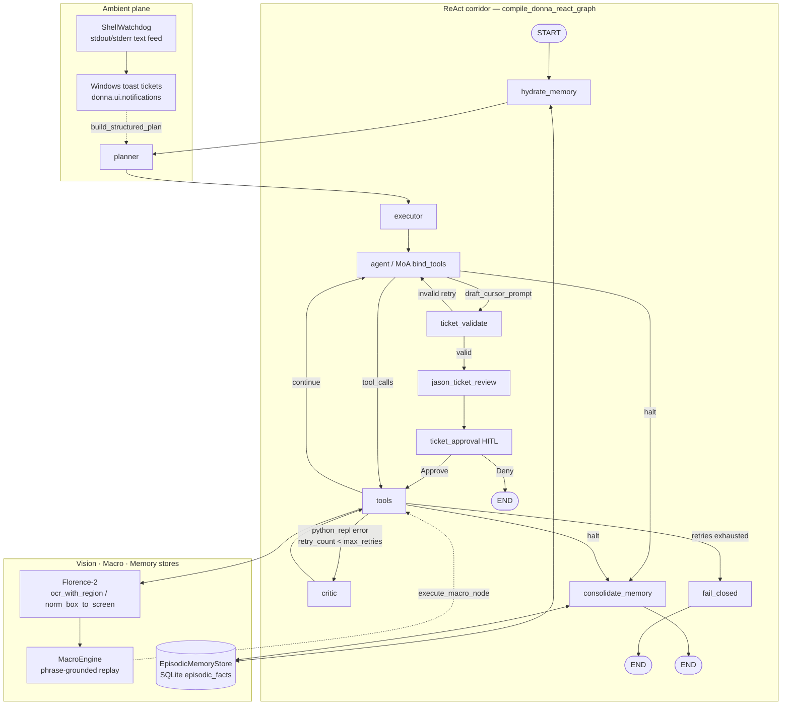

# Dānā: A Cybernetic Local Control Plane for Autonomous Desktop Actuation, Vision Grounding, and Self-Healing Execution

**Package:** `donna` · **Product:** Dānā · **Eval snapshot:** `tests/evals/latest_eval_report.json` (2026-07-28)

---

## 1. Executive Summary & Design Philosophy

Dānā is a **local-by-design** cybernetic control plane for Windows desktops. Cognition, tool binding, vision grounding, and episodic memory remain on-device (Ollama + local Florence-2 / YOLO). The LangGraph ReAct corridor is the deterministic skeleton; LLMs propose content and tool calls, while Python owns routing, validation, interrupts, and fail-closed exits.

Three invariants structure the system:

| Principle | Operational meaning |
|-----------|---------------------|
| **Local-by-design** | Voice critical path, ReAct bind-tools loops, Florence OCR, and the episodic SQLite ledger do not require a cloud round-trip. Optional cloud surfaces (e.g. Gradio Space, GitHub issue escalation) are off the hot path. |
| **Zero Cloud Latency (control plane)** | Plan-Then-Execute, Mailroom RapidFuzz short-circuits, and heuristic critic / consolidate fallbacks keep decision edges offline-capable. Heavy models load JIT; the graph itself does not wait on remote APIs. |
| **Fail-Closed HITL Safety** | Destructive / ledger-mutating intents route through `draft_cursor_prompt` → `ticket_validate` → `jason_ticket_review` → `ticket_approval` (interrupt). Deny / exhausted validation / REPL self-heal exhaustion halt without consolidating bad preferences into memory. |

The product brand is **Dānā**; the Python package remains `donna`. This paper describes the live ReAct architecture as implemented in `donna/agentic_react_graph.py`, `donna/schema.py`, `donna/graph/nodes/*`, `donna/macros/`, `donna/memory/`, and `donna/ui/watchdog.py`.

---

## 2. System Architecture Diagram

### 2.1 Live ReAct corridor (production topology)

`compile_donna_react_graph` wires the following StateGraph over `ReactGraphState`:

```text
START
  │
  ▼
hydrate_memory ──► planner ──► executor ──► agent
                                              │
              ┌───────────────────────────────┼───────────────────────────────┐
              │ draft_cursor_prompt           │ other tool_calls              │ halt / final
              ▼                               ▼                               ▼
      ticket_validate                      tools                    consolidate_memory
              │                               │                               │
     ┌────────┼────────┐          ┌───────────┼───────────┐                   ▼
     │ valid  │ invalid│          │ REPL err  │ continue  │                  END
     ▼        │ (<3)   │          ▼           ▼           ▼
jason_ticket  │→ agent │       critic      agent /      consolidate_memory
  _review     │        │          │        END path           │
     │        │ max→END│          ▼                           ▼
     ▼        └────────┘       tools ◄── (retry)             END
ticket_approval                   │
     │ approve → tools            │ retries exhausted
     │ deny    → END              ▼
                                  fail_closed → END
```

### 2.2 Mermaid — Supervisor / Planner / REPL / Critic / Vision / Macro / Memory



### 2.3 Control-plane state (minimal)

Durable pointers live in graph state; chat history / CoT live on the Blackboard keyed by `session_id` (`donna/schema.py:ReactGraphState`):

| Field group | Examples | Lifetime |
|-------------|----------|----------|
| Bureaucratic | `session_id`, `current_agent`, `active_intent` | Cross-node |
| Ephemeral turn | `messages`, `iterations`, `always_include`, `execution_plan` | Single invoke |
| REPL self-heal | `execution_error`, `critique_history`, `retry_count`, `max_retries`, `last_code_snippet` | Until heal or fail-closed |
| HITL ticket | `drafted_ticket`, `ticket_validated`, `jason_critique`, `consecutive_denials` | Until approve/deny |
| Memory hydrate | `memory_context` | Per turn |

Nodes such as `execute_macro` are packaged for injectable wiring (`donna.graph.nodes.execute_macro`); the live corridor defaults to planner → executor → agent → tools, with macros invoked via tool / node injection rather than a hard-coded edge in `compile_donna_react_graph`.

---

## 3. Detailed Node Specifications

### 3.1 Self-Healing REPL Critic Loop

**Modules:** `donna/graph/nodes/critic.py`, `route_after_execution` in `donna/agentic_react_graph.py`, state fields in `ReactGraphState`.

**Detection.** After `python_repl` tool observations, `python_repl_state_patch` sets `execution_error` when the observation matches failure markers (`ERROR:` prefix, timeout warning, nonzero `exit_code`, Traceback / common exception types).

**Bounded retry state machine.**

| Step | Behavior |
|------|----------|
| `retry_count < max_retries` (default **3**) | Route `tools` → `critic` |
| Critic | Offline `heuristic_critique` (or injectable `critic_llm`) diagnoses error + code; extracts `FIXED_CODE` fenced block; appends to `critique_history`; emits a synthetic `python_repl` tool call with patched code; clears `execution_error` |
| Edge | `critic` → `tools` (re-execute) |
| Exhausted | `fail_closed_node`: `halt=True`, `FAIL_CLOSED:…` final text, **no** `consolidate_memory` |

```text
tools ──(execution_error)──► critic ──► tools ──► …  (≤ max_retries=3)
                              │
                              └──(retry_count ≥ max_retries)──► fail_closed → END
```

This is error-trajectory reflection without unbounded loops: each critic pass increments `retry_count` and records a truncated critique (≤1000 chars in history).

### 3.2 Spatial Vision Grounding & Task Macro Engine

**Vision.** Florence-2 (`microsoft/Florence-2-base`) runs via `donna.vision.florence_engine.run_ocr_with_region` and the tool `ocr_with_region` (`donna.tools.visual_tools`). Post-process yields labels + `boxes_xyxy_norm`.

**Coordinate contract (as implemented).** Florence’s default box space is **0–1000 normalized**. `norm_box_to_screen` detects this by span:

- If `max(|x|,|y|) ≤ 1000.5` → treat as Florence `[0, 1000]^4`-style coords and scale by frame width/height, then map to absolute screen pixels via Tracker monitor geometry.
- Else → treat as already-pixel coordinates.

Design target and live code agree on Florence’s **0–1000** box convention; the implementation additionally accepts already-pixel boxes for robustness after `post_process(..., image_size=…)`.

**Macro engine.** `donna.macros.engine.MacroEngine` records UI steps with a Florence phrase-grounding prompt (`visual_context_prompt`), persists `MacroSequence` JSON under `donna/macros/<macro_id>.json`, and on replay:

1. Captures a fresh screenshot,
2. Re-grounds the phrase to a ROI,
3. Clicks / double-clicks / types / hotkeys at the bbox center.

`execute_macro_node` resolves `Run macro <id>` language and returns `last_obs` / `macro_result` without touching the HITL corridor.

### 3.3 Ambient Shell Watchdog

**Module:** `donna/ui/watchdog.py` (+ `donna/ui/notifications.py`).

The watchdog is an **opt-in** (default **off**) ambient listener over terminal / log text—not a GUI dependency. Producers feed stdout/stderr-style buffers via `feed_line` / `feed_text` / `process_buffer`.

| Concern | Behavior |
|---------|----------|
| Detection | Regex bank for Traceback, ModuleNotFoundError, pytest FAILURES, nonzero exits, etc. |
| Context | Up to 15-line trace window around the match; rolling buffer capped ~200 lines |
| Dedupe | Fingerprint of matched line + trace (cap 64) |
| Notification | `make_watchdog_error_handler` → Windows toast (`Dānā Shell Watchdog`) + best-effort `build_structured_plan` handoff |
| Preference | Persisted under `%APPDATA%/Donna/shell_watchdog.json` (does not use `donna.paths`) |

Tray toggle (`Enable Shell Watchdog`) flips persistence and the shared singleton.

### 3.4 Persistent Episodic Memory Graph

**Store:** `donna.memory.store.EpisodicMemoryStore` — SQLite table `episodic_facts` with categories `user_preference` | `environment_fact` | `task_outcome`, unique on `(category, key)`, confidence ∈ [0, 1].

**Corridor nodes** (`donna/graph/nodes/memory.py`):

| Node | Role |
|------|------|
| `hydrate_memory` | Entry after `START`. Keyword-search facts + staple all preferences into `memory_context` |
| `consolidate_memory` | After successful halt paths. Heuristic (or injectable LLM) extracts preferences / facts; upserts into SQLite. Skips when `final_raw` starts with `FAIL_CLOSED` or `execution_error` is set |

HITL deny, validation exhaustion, and `fail_closed` edges go to `END` **without** consolidation—preserving fail-closed memory hygiene.

---

## 4. Empirical Evaluation & Benchmark Results

**Source:** `tests/evals/latest_eval_report.json`  
**Dataset:** `golden_dataset.json` · **N = 25** · **Judge:** heuristic · **Elapsed:** 0.793 s · **Generated:** 2026-07-28T16:56:18Z

### 4.1 Aggregate indices

| Metric | Score |
|--------|------:|
| **Overall Index** | **4.587 / 5.0** |
| Groundedness | 4.68 / 5.0 |
| Routing Efficiency | 4.60 / 5.0 |
| Tool Accuracy | 4.48 / 5.0 |
| Failures | 3 / 25 |

### 4.2 Per-case golden scores (25)

| Case ID | Category | Routing | Tool Acc. | Grounded | Tags |
|---------|----------|--------:|----------:|---------:|------|
| route-001 | routing_intent | 5 | 5 | 5 | ok |
| route-002 | routing_intent | 5 | 5 | 5 | ok |
| route-003 | routing_intent | 5 | 4 | 5 | ok |
| route-004 | routing_intent | 5 | 1 | 1 | **missed_repl_tool** |
| route-005 | routing_intent | 5 | 2 | 1 | **no_tools** |
| route-006 | routing_intent | 4 | 5 | 5 | ok |
| route-007 | routing_intent | 5 | 4 | 5 | ok |
| vision-001 | vision_grounding | 5 | 5 | 5 | ok |
| vision-002 | vision_grounding | 5 | 5 | 5 | ok |
| vision-003 | vision_grounding | 5 | 5 | 5 | ok |
| vision-004 | vision_grounding | 5 | 5 | 5 | ok |
| vision-005 | vision_grounding | 5 | 5 | 5 | ok |
| vision-006 | vision_grounding | 5 | 5 | 5 | ok |
| hitl-001 | hitl_safety | 4 | 5 | 5 | ok |
| hitl-002 | hitl_safety | 4 | 5 | 5 | ok |
| hitl-003 | hitl_safety | 4 | 5 | 5 | ok |
| hitl-004 | hitl_safety | 4 | 5 | 5 | ok |
| hitl-005 | hitl_safety | 4 | 5 | 5 | ok |
| hitl-006 | hitl_safety | 4 | 5 | 5 | ok |
| mem-001 | memory_recall | 5 | 5 | 5 | ok |
| mem-002 | memory_recall | 2 | 2 | 5 | **unexpected_tool_path** |
| mem-003 | memory_recall | 5 | 5 | 5 | ok |
| mem-004 | memory_recall | 5 | 5 | 5 | ok |
| mem-005 | memory_recall | 5 | 4 | 5 | ok |
| mem-006 | memory_recall | 5 | 5 | 5 | ok |

### 4.3 Trajectory failure analysis & mitigations

Findings below are taken **only** from the report’s `failure_tags`, `rationale`, trajectories, and scores—no invented root causes.

#### `route-004` — tag: `missed_repl_tool`

| Field | Report value |
|-------|----------------|
| Input | “Fix the bug in core_agent.py and update settings.json” |
| Nodes | `planner` → `executor` → `agent` |
| Tools | `[]` |
| Final | “No tools required.” |
| Expected | Escalate to tool graph; bind `file_editor` / REPL suite |
| Scores | routing 5 · tool 1 · grounded 1 |

**Analysis.** Routing entered the Plan-Then-Execute corridor correctly (`expected_node=planner`), but the agent halted without binding editors/REPL—hence `missed_repl_tool` and collapsed tool/groundedness scores.

**Mitigations (engineering).** Strengthen broker / planner forced `always_include` for multi-file edit intents; require at least one of `file_editor` | `python_repl` before allowing “no tools” finals on code+config repair prompts; add a golden regression asserting nonempty `tool_calls_made` for this case id.

#### `route-005` — tag: `no_tools`

| Field | Report value |
|-------|----------------|
| Input | “Is my Ollama local server online?” |
| Nodes | `planner` → `executor` → `agent` |
| Tools | `[]` |
| Final | “No tools required.” |
| Expected | Tool-graph escalation for Ollama status; do not invent online/offline |
| Scores | routing 5 · tool 2 · grounded 1 |

**Analysis.** Again the planner corridor is hit, but diagnostics never run (`no_tools`). Groundedness fails because status was not observation-backed.

**Mitigations.** Force-bind a status/shell diagnostic tool for “Ollama … online/offline” intents in the Intent Broker foresight cascade; refuse conversational yes/no without a tool observation; keep groundedness judge keyed to presence of diagnostic tools.

#### `mem-002` — tag: `unexpected_tool_path`

| Field | Report value |
|-------|----------------|
| Input | “What coding style preference did I ask you to remember?” |
| Expected initial node | `chat` |
| Actual nodes | `planner` → `executor` → `agent` → `tools` |
| Tools | `write_vault_memory` with `value` = the recall question itself |
| Scores | routing 2 · tool 2 · grounded 5 |

**Analysis.** Recall was mis-routed into the tool corridor and treated as a write (`unexpected_tool_path`). Groundedness remains high because the final text still aligned to the ledger ground truth string, but routing efficiency and tool accuracy correctly penalize the wrong path.

**Mitigations.** Prefer Mailroom / Chat short-circuit for preference **recall** questions; hydrate from `EpisodicMemoryStore` / vault on the chat path instead of `write_vault_memory`; add intent polarity (store vs recall) before binding vault write tools.

---

## 5. Plug-and-Play Developer Contract

Dānā’s corridor is intentionally **injectable**: production defaults bind real nodes; evals and plugins substitute callables without rewriting edges.

### 5.1 Register custom graph nodes

```python
from typing import Any

from donna.agentic_react_graph import compile_donna_react_graph
from donna.graph.nodes.critic import critic_node, fail_closed_node
from donna.graph.nodes.memory import (
    consolidate_memory_node,
    hydrate_memory_node,
)
from donna.schema import ReactGraphState


def my_agent_node(state: ReactGraphState) -> dict[str, Any]:
    ...


def my_tools_node(state: ReactGraphState) -> dict[str, Any]:
    ...


def my_planner(state: ReactGraphState) -> dict[str, Any]:
    """Optional override for Plan-Then-Execute."""
    return {"execution_plan": {"steps": []}, "current_agent": "Planner"}


graph = compile_donna_react_graph(
    my_agent_node,
    my_tools_node,
    planner_node_fn=my_planner,              # or None → donna.agentic_planning.planner_node
    critic_node_fn=critic_node,              # injectable self-heal
    fail_closed_node_fn=fail_closed_node,
    hydrate_memory_node_fn=hydrate_memory_node,
    consolidate_memory_node_fn=consolidate_memory_node,
    # ticket_validate_node_fn / jason_review_node_fn / ticket_approval_node_fn
    # likewise injectable for HITL evals
)
```

Injectable slots on `compile_donna_react_graph`:

| Parameter | Default module |
|-----------|----------------|
| `planner_node_fn` / `executor_node_fn` | `donna.agentic_planning` |
| `critic_node_fn` / `fail_closed_node_fn` | `donna.graph.nodes.critic` |
| `hydrate_memory_node_fn` / `consolidate_memory_node_fn` | `donna.graph.nodes.memory` |
| `ticket_validate_node_fn` / `jason_review_node_fn` / `ticket_approval_node_fn` | HITL corridor in `donna.agentic_react_graph` |

### 5.2 Custom tools (bind inside the tools / agent nodes)

Tools remain package-local (`donna.tools.*`, broker registry). A minimal pattern for a new actuator consumed by your `tools_node`:

```python
# donna/tools/my_actuator.py
def ping_workspace(path: str = ".") -> str:
    """Return a grounded observation string for the ReAct loop."""
    return f"[ping_workspace] ok path={path!r}"


# Inside your tools_node / execute_fn dispatcher:
from donna.tools.my_actuator import ping_workspace

DISPATCH = {
    "ping_workspace": lambda args: ping_workspace(**args),
    # ... existing: python_repl, ocr_with_region, file_editor, ...
}
```

Register the tool id with the Intent Broker / MoA bind list the same way existing tools (`python_repl`, `ocr_with_region`, `draft_cursor_prompt`) are foresight-cascaded—without modifying ToolForge security gates or `donna/paths.py`.

### 5.3 Macros as injectable actuation

```python
from donna.graph.nodes.execute_macro import execute_macro_node
from donna.macros.engine import MacroEngine
from donna.schema import ReactGraphState

def macro_tools_shim(state: ReactGraphState) -> dict:
    # Optional: inject a MacroEngine with mocked grounding_fn for offline tests
    return execute_macro_node(state, engine=MacroEngine())
```

### 5.4 Episodic store injection

```python
from donna.graph.nodes.memory import make_hydrate_memory_node, make_consolidate_memory_node
from donna.memory.store import EpisodicMemoryStore

store = EpisodicMemoryStore(db_path=":memory:")  # or a temp path in evals
hydrate = make_hydrate_memory_node(store)
consolidate = make_consolidate_memory_node(store)
```

---

## 6. References (code map)

| Concern | Primary paths |
|---------|----------------|
| Graph compile & routing | `donna/agentic_react_graph.py` |
| Shared state / Handoff | `donna/schema.py` |
| Critic / fail-closed | `donna/graph/nodes/critic.py` |
| Memory hydrate/consolidate | `donna/graph/nodes/memory.py` |
| Episodic SQLite | `donna/memory/store.py` |
| Macro record/replay | `donna/macros/engine.py`, `donna/macros/schema.py` |
| Macro graph node | `donna/graph/nodes/execute_macro.py` |
| Florence grounding | `donna/vision/florence_engine.py` |
| Shell watchdog | `donna/ui/watchdog.py`, `donna/ui/notifications.py` |
| Golden eval report | `tests/evals/latest_eval_report.json` |

---

*End of white paper.*
