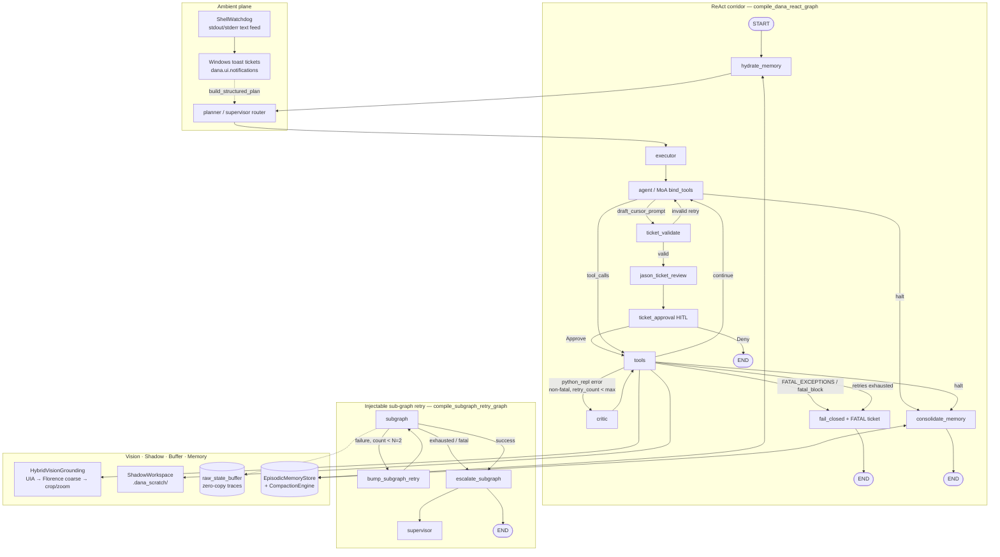

# Dānā: A Production-Hardened Cybernetic Control Plane for Autonomous Desktop Actuation, Vision Grounding, and Self-Healing Execution

**Package:** `dana` · **Product:** Dānā / Dana · **OSWorld snapshot:** `tests/evals/osworld_bench_summary.json` · **Golden eval:** `tests/evals/latest_eval_report.json` (2026-07-28)

---

## Abstract & Design Philosophy

Dānā is a **production-hardened**, local-by-design cybernetic control plane for Windows desktops. Cognition, tool binding, hybrid vision grounding, transactional file mutation, and episodic memory remain on-device (Ollama + local Florence-2 / YOLO). The LangGraph ReAct corridor is the deterministic skeleton; LLMs propose content and tool calls, while Python owns routing, validation, interrupts, shadow commits, fatal classification, and fail-closed exits.

The system has been evaluated against **adversarial OSWorld-style benchmark conditions** (`tests/evals/test_osworld_bench.py`): seedable desktop translation noise (±5–15 px), toast overlays, and 50–300 ms actuation jitter via `DesktopNoiseInjector`, scored by `OSWorldAdapter` without requiring a live OSWorld download.

Three invariants structure the system:

| Principle | Operational meaning |
|-----------|---------------------|
| **Local-by-design** | Voice critical path, ReAct bind-tools loops, Florence OCR, hybrid UIA grounding, and the episodic SQLite ledger do not require a cloud round-trip. Optional cloud surfaces (e.g. Gradio Space, GitHub issue escalation) are off the hot path. |
| **Zero Cloud Latency (control plane)** | Plan-Then-Execute, Mailroom RapidFuzz short-circuits, heuristic critic / consolidate fallbacks, and autonomous sub-graph retries (N=2) keep decision edges offline-capable. Heavy models load JIT; the graph itself does not wait on remote APIs. |
| **Fail-Closed HITL Safety** | Destructive / ledger-mutating intents route through `draft_cursor_prompt` → `ticket_validate` → `jason_ticket_review` → `ticket_approval` (interrupt). `FATAL_EXCEPTIONS` bypass Critic retries and draft HITL tickets. Deny / exhausted validation / REPL self-heal exhaustion halt without consolidating bad preferences into memory. |

The product brand is **Dānā** / **Dana**; the Python package is `dana`. Supporting packages: `dana_jason_loop/`, `dana_security/`. This paper describes the live ReAct architecture as implemented in `dana/agentic_react_graph.py`, `dana/schema.py`, `dana/graph/`, `dana/exec/shadow_workspace.py`, `dana/vision/hybrid_grounding.py`, `dana/memory/`, and `dana/ui/watchdog.py`.

---

## 1. Architecture & Topology

### 1.1 Live ReAct corridor (production topology)

`compile_dana_react_graph` wires the following StateGraph over `ReactGraphState`. Entry is **Memory Hydration → Supervisor Router** (`hydrate_memory` → `planner` Plan-Then-Execute), then executor → agent:

```text
START
  │
  ▼
hydrate_memory ──► planner (supervisor router) ──► executor ──► agent
                                                                  │
              ┌───────────────────────────────────────────────────┼───────────────────────────────┐
              │ draft_cursor_prompt                               │ other tool_calls              │ halt / final
              ▼                                                   ▼                               ▼
      ticket_validate                                          tools                    consolidate_memory
              │                                                   │                               │
     ┌────────┼────────┐          ┌───────────────────────────────┼───────────────┐               ▼
     │ valid  │ invalid│          │ REPL err      │ fatal_block   │ continue      │              END
     ▼        │ (<3)   │          ▼               ▼               ▼               │
jason_ticket  │→ agent │       critic        fail_closed       agent /            │
  _review     │        │          │          (+ HITL ticket)   END path           │
     │        │ max→END│          ▼               │                               │
     ▼        └────────┘       tools ◄── (retry)  ▼                               │
ticket_approval                   │              END                              │
     │ approve → tools            │ retries exhausted                             │
     │ deny    → END              ▼                                               │
                                  fail_closed → END                               │
                                                                                  │
Actuation plane (from tools):                                                     │
  · Hybrid Win32 UIA + 2-Stage Crop & Zoom Florence-2                             │
  · Transactional Shadow Workspace (.dana_scratch/<session_id>/)                  │
  · Zero-Copy raw_state_buffer + Sub-Graph Retry (N=2)                            │
Memory plane:                                                                     │
  · CompactionEngine — exponential decay (λ=0.05/hr) + spatial TTL (900s)         │
```

### 1.2 Mermaid — Hydration · Supervisor · Shadow · Vision · Buffer · Memory



### 1.3 Control-plane state (minimal)

Durable pointers live in graph state; chat history / CoT live on the Blackboard keyed by `session_id` (`dana/schema.py:ReactGraphState`):

| Field group | Examples | Lifetime |
|-------------|----------|----------|
| Bureaucratic | `session_id`, `current_agent`, `active_intent` | Cross-node |
| Ephemeral turn | `messages`, `iterations`, `always_include`, `execution_plan` | Single invoke |
| REPL self-heal | `execution_error`, `critique_history`, `retry_count`, `max_retries`, `last_code_snippet` | Until heal or fail-closed |
| Fatal / HITL | `fatal_block`, `drafted_ticket`, `ticket_validated`, `jason_critique`, `consecutive_denials` | Until approve/deny or halt |
| Zero-copy diagnostics | `raw_state_buffer`, `subgraph_retry_count`, `max_subgraph_retries` | Until escalate / clear |
| Memory hydrate | `memory_context` | Per turn |

---

## 2. Detailed Subsystem Specs

### 2.1 Transactional Shadow Workspaces & Fatal Error Classification

**Shadow workspaces** (`dana/exec/shadow_workspace.py`). File mutations from REPL / `file_editor` stage under `.dana_scratch/<session_id>/` first:

| Outcome | Behavior |
|---------|----------|
| `exit_code == 0` | `commit()` copies staged files to destinations, then clears scratch |
| Nonzero exit / exception | `rollback()` discards scratch; destination paths untouched |
| Context binding | `bind_shadow_workspace` / `get_active_shadow` via `ContextVar` for tool hooks |

`run_shadow_transaction(session_id, runner)` is the canonical API: commit on success, rollback otherwise.

**Fatal error classification** (`dana/graph/nodes/critic.py`). `FATAL_EXCEPTIONS` are never Critic-healed:

```text
PermissionError | FileNotFoundError | ModuleNotFoundError
ConnectionRefusedError | TimeoutError | OSError
```

When `fatal_block` or `is_fatal_execution_error(...)` is true, `route_after_execution` sends **tools → fail_closed** (bypass Critic retries). `fail_closed_node` / fatal Critic short-circuit draft a structured HITL ticket (`drafted_ticket` with objective `Fatal OS Block: Missing dependency or permission denied`) on the existing ticket corridor fields—without consolidating memory.

Fixable code faults (`SyntaxError`, `NameError`, `TypeError`, …) remain on the bounded Critic loop (`max_retries` default **3**).

### 2.2 Spatial Coordinate TTL (900s) & Exponential Decay

**Spatial TTL** (`dana/graph/nodes/memory.py`). On consolidate, spatial / UI location facts receive `ttl_seconds = SPATIAL_FACT_TTL_SECONDS` (**900** = 15 minutes) when not explicitly set. Hydrate calls `prune_expired_entries()` before search so stale click targets and element locations do not poison grounding.

**Exponential decay** (`dana/memory/compaction.py` · `CompactionEngine`). After consolidate, `compact_memory` applies:

\[
W = W_0 \cdot \exp(-\lambda \cdot \Delta\mathrm{hours}), \quad \lambda = 0.05\ \mathrm{(procedural)}
\]

| Category | \(\lambda\) | Policy |
|----------|-------------|--------|
| Procedural / non-preference facts | **0.05 / hour** | Pruned when decayed weight &lt; **0.15** |
| `user_preference` | **0.0** | Never decay |

### 2.3 Hybrid Win32 UIA + Crop-and-Zoom Florence-2

**Module:** `dana/vision/hybrid_grounding.py` · `HybridVisionGrounding` + `dana/vision/uia_provider.py` · `Win32UIAProvider`.

Pipeline (all side-effects injectable for offline evals):

1. **UIA first** — `Win32UIAProvider.find_element_bounds(label)` → return `[0, 1000]^4` immediately on hit.
2. **Coarse Florence** — phrase ground on the full frame via `run_ocr_with_region`.
3. **Crop & zoom if small** — if coarse width **or** height &lt; **30** (1000-scale): crop ROI with **15%** padding (`ROI_PADDING = 0.15`), upscale **2×** (Lanczos/bicubic), fine Florence on the zoomed crop, project back to global `[0, 1000]^4`.

Stage tags: `uia` | `coarse` | `zoom` | `miss`. Coordinate contract remains Florence **0–1000** normalized (with already-pixel acceptance in `norm_box_to_screen` / conversion helpers).

### 2.4 Zero-Copy State Buffer & Autonomous Sub-Graph Retries (N=2)

**Zero-copy buffer** (`dana/graph/buffer.py`). `store_raw_trace` writes the **full** traceback + exception metadata into `raw_state_buffer.last_error` without LLM truncation. Supervisors and critics may summarize separately; diagnostics stay complete.

**Sub-graph retries** (`dana/graph/subgraph_router.py`). Default `max_subgraph_retries = 2` (`DEFAULT_MAX_SUBGRAPH_RETRIES`):

```text
START → subgraph ─(non-fatal, count < 2)→ bump_subgraph_retry → subgraph
               ─(exhausted / fatal)→ escalate_subgraph → supervisor → END
               ─(success)→ escalate_subgraph → END
```

Fatal failures (`fatal_block` / `FATAL_EXCEPTIONS`) skip local retries and escalate immediately with `raw_state_buffer` intact. This corridor is injectable via `compile_subgraph_retry_graph` and does not rewrite ToolForge gates or `dana/paths.py`.

### 2.5 Legacy corridor nodes (still live)

| Subsystem | Modules | Role |
|-----------|---------|------|
| Self-healing REPL Critic | `dana/graph/nodes/critic.py` | Bounded patch loop for fixable errors; fatal → HITL |
| Macro engine | `dana/macros/engine.py` | Phrase-grounded record/replay |
| Shell Watchdog | `dana/ui/watchdog.py` | Opt-in ambient Traceback → toast + plan handoff |
| Episodic store | `dana/memory/store.py` | SQLite `episodic_facts` + TTL prune |

---

## 3. Empirical Evaluation & OSWorld

### 3.1 OSWorldAdapter methodology

**Harness:** `tests/evals/test_osworld_bench.py`  
**Adapter:** `tests/evals/osworld_adapter.py` · `OSWorldAdapter`  
**Noise:** `tests/evals/noise_injector.py` · `DesktopNoiseInjector`  
**Summary artifact:** `tests/evals/osworld_bench_summary.json`

Offline OSWorld-style evaluation (no network / OSWorld download):

1. Load fixture JSON (`load_osworld_fixture`) → map to `ReactGraphState` via `OSWorldAdapter.task_to_agent_state`.
2. Apply adversarial desktop noise with `DesktopNoiseInjector`:
   - Screen / bbox translation **±5–15 px** (`_SHIFT_MIN_PX` / `_SHIFT_MAX_PX`)
   - Synthetic toast overlays (fixed RGB accent block)
   - Actuation latency jitter **50–300 ms** production range (deterministic mode uses a cheap 1–5 ms band for CI speed)
3. Ground UI via `HybridVisionGrounding` + injectable `Win32UIAProvider` / Florence mocks.
4. Score click/tool trajectories with `OSWorldAdapter` (`click_tol_px` / `bbox_tol_px`, default 10 px): precision, task completion, composite score.

### 3.2 OSWorld offline summary (logged scores)

Source: `tests/evals/osworld_bench_summary.json` — **read from disk; not invented.**

| Metric | Value |
|--------|------:|
| Benchmark | `osworld_offline` |
| Task ID | `osworld_open_notepad_save` |
| Runs (N) | **5** |
| Mean precision | **1.0** |
| Mean task completion | **1.0** |
| Mean score | **1.0** |
| All runs passed | **true** |

| Run | Seed | Offset (px) | Latency (s) | Precision | Task completion | Score |
|----:|-----:|------------:|------------:|----------:|----------------:|------:|
| 0 | 42 | (−5, 8) | 0.00356 | 1.0 | 1.0 | 1.0 |
| 1 | 43 | (−7, −10) | 0.00115 | 1.0 | 1.0 | 1.0 |
| 2 | 44 | (−13, 6) | 0.00263 | 1.0 | 1.0 | 1.0 |
| 3 | 45 | (12, 9) | 0.00209 | 1.0 | 1.0 | 1.0 |
| 4 | 46 | (11, −14) | 0.00455 | 1.0 | 1.0 | 1.0 |

Reproduce:

```bash
pytest tests/evals/test_osworld_bench.py -q
```

### 3.3 Golden dataset (supplementary)

**Source:** `tests/evals/latest_eval_report.json` · **N = 25** · heuristic judge · **Overall Index 4.587 / 5.0** (Groundedness 4.68 · Routing 4.60 · Tool Accuracy 4.48 · Failures 3/25). Failure tags observed: `missed_repl_tool` (`route-004`), `no_tools` (`route-005`), `unexpected_tool_path` (`mem-002`).

---

## 4. Modular Extension Contract

Dānā’s corridor is intentionally **injectable**: production defaults bind real nodes; evals and plugins substitute callables without rewriting edges. All imports use the `dana` package.

### 4.1 Register custom graph nodes

```python
from typing import Any

from dana.agentic_react_graph import compile_dana_react_graph
from dana.graph.nodes.critic import critic_node, fail_closed_node
from dana.graph.nodes.memory import (
    consolidate_memory_node,
    hydrate_memory_node,
)
from dana.schema import ReactGraphState


def my_agent_node(state: ReactGraphState) -> dict[str, Any]:
    ...


def my_tools_node(state: ReactGraphState) -> dict[str, Any]:
    ...


def my_planner(state: ReactGraphState) -> dict[str, Any]:
    """Optional override for Plan-Then-Execute / supervisor router."""
    return {"execution_plan": {"steps": []}, "current_agent": "Planner"}


graph = compile_dana_react_graph(
    my_agent_node,
    my_tools_node,
    planner_node_fn=my_planner,
    critic_node_fn=critic_node,
    fail_closed_node_fn=fail_closed_node,
    hydrate_memory_node_fn=hydrate_memory_node,
    consolidate_memory_node_fn=consolidate_memory_node,
)
```

### 4.2 Sub-graph retries + zero-copy buffer

```python
from dana.graph.buffer import store_raw_trace
from dana.graph.subgraph_router import (
    apply_subgraph_failure,
    compile_subgraph_retry_graph,
)


def my_subgraph(state: dict) -> dict:
    try:
        ...
    except Exception as exc:
        return apply_subgraph_failure(state, exc)


def my_supervisor(state: dict) -> dict:
    return {"current_agent": "Supervisor"}


retry_graph = compile_subgraph_retry_graph(my_subgraph, my_supervisor)
```

### 4.3 Custom tools

```python
# dana/tools/my_actuator.py
def ping_workspace(path: str = ".") -> str:
    """Return a grounded observation string for the ReAct loop."""
    return f"[ping_workspace] ok path={path!r}"


# Inside your tools_node / execute_fn dispatcher:
from dana.tools.my_actuator import ping_workspace

DISPATCH = {
    "ping_workspace": lambda args: ping_workspace(**args),
}
```

Register the tool id with the Intent Broker / MoA bind list the same way existing tools are foresight-cascaded—without modifying ToolForge security gates or `dana/paths.py`.

### 4.4 Shadow workspace + hybrid vision injection

```python
from dana.exec.shadow_workspace import ShadowWorkspace, run_shadow_transaction
from dana.vision.hybrid_grounding import HybridVisionGrounding
from dana.vision.uia_provider import Win32UIAProvider

ws, code, obs = run_shadow_transaction("eval-session", lambda w: (0, "ok"))

grounder = HybridVisionGrounding(
    uia_provider=Win32UIAProvider(control_tree=[]),
    florence_ground_fn=my_florence_fn,  # injectable
)
box = grounder.locate_ui_element(image, "Save")
```

### 4.5 Episodic store + compaction

```python
from dana.graph.nodes.memory import make_hydrate_memory_node, make_consolidate_memory_node
from dana.memory.compaction import CompactionEngine
from dana.memory.store import EpisodicMemoryStore

store = EpisodicMemoryStore(db_path=":memory:")
hydrate = make_hydrate_memory_node(store)
consolidate = make_consolidate_memory_node(store)
CompactionEngine().compact_memory(store)
```

---

## 5. References (code map)

| Concern | Primary paths |
|---------|----------------|
| Graph compile & routing | `dana/agentic_react_graph.py` |
| Shared state / Handoff | `dana/schema.py` |
| Critic / FATAL / fail-closed | `dana/graph/nodes/critic.py` |
| Shadow workspaces | `dana/exec/shadow_workspace.py` |
| Zero-copy buffer | `dana/graph/buffer.py` |
| Sub-graph retries (N=2) | `dana/graph/subgraph_router.py` |
| Hybrid UIA + crop/zoom | `dana/vision/hybrid_grounding.py`, `dana/vision/uia_provider.py` |
| Memory hydrate/consolidate | `dana/graph/nodes/memory.py` |
| Exponential compaction | `dana/memory/compaction.py` |
| Episodic SQLite | `dana/memory/store.py` |
| Jason loop package | `dana_jason_loop/` |
| Security / patch ledger | `dana_security/` |
| OSWorld harness | `tests/evals/test_osworld_bench.py` |
| OSWorld summary | `tests/evals/osworld_bench_summary.json` |
| Golden eval report | `tests/evals/latest_eval_report.json` |

---

*End of white paper.*
