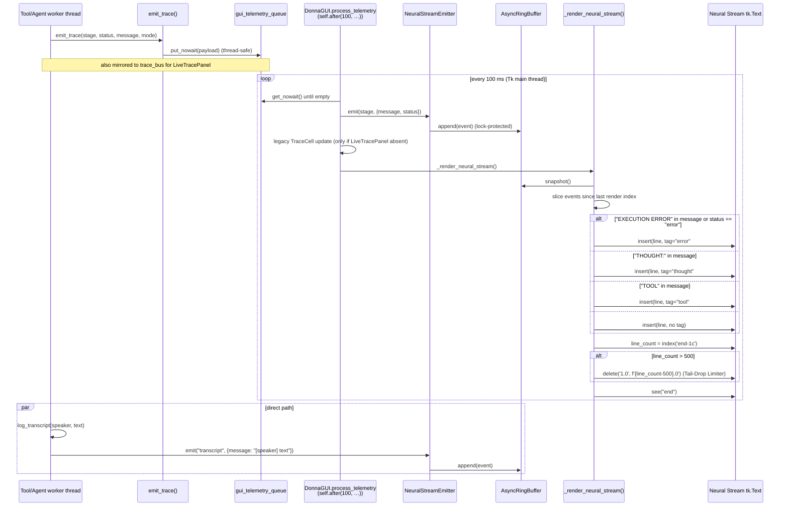
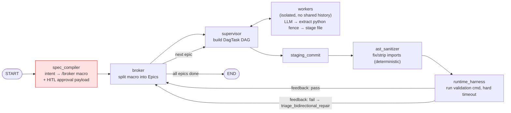
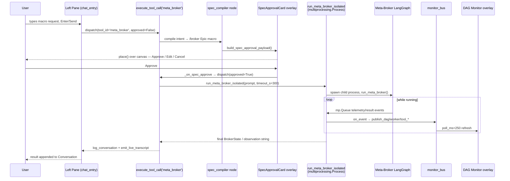

# Dānā System Overview — Unified Canvas Era

**Scope:** a current-state snapshot of the GUI layer, telemetry subsystem, and
agent execution graph, written after the `dana/core_agent.py` refactor that
replaced the old notebook/tab dashboard with a single 60/40 **Unified Canvas**.
Intended to help spot enhancement opportunities, not to replace the deeper
existing docs it links to below.

**Related docs** (this file extends rather than duplicates them):
- [`docs/telemetry_and_ui.md`](../telemetry_and_ui.md) — the original Live
  Trace design doc. Still accurate for the legacy `gui_telemetry_queue` /
  `TraceCell` path and the JSONL forensic logger; it predates the Neural
  Stream / `AsyncRingBuffer` path documented here.
- [`docs/architecture/donna_architecture.md`](donna_architecture.md) — the
  auto-exported ReAct `StateGraph` (chat/vision/research turns). A
  **different** graph from the DAG-supervisor/Meta-Broker graph covered below.
- [`docs/architecture/LLM_SYSTEM_MAP.md`](LLM_SYSTEM_MAP.md) — broader
  system map.
- [`ARCHITECTURE.md`](../../ARCHITECTURE.md) — top-level package layout index.

---

## 1. High-level component map

Dānā runs as one Tk process (the GUI, background audio/telemetry threads) plus
one isolated **child process** per Meta-Broker run. Everything in the GUI
process talks to the outside world through a handful of thread-safe buses;
nothing outside the GUI process calls Tk directly.

```mermaid
flowchart TB
    subgraph GUI["DonnaGUI process (Tk main thread)"]
        direction TB
        HDR["Header HUD<br/>Engage/Standby · STOP · Diagnostics · Tasks ▸ · DAG ▸"]
        subgraph CANVAS["Unified Agent Canvas (60/40 split)"]
            direction LR
            LEFT["Left Pane (60%)<br/>Conversation + chat_entry + Send"]
            subgraph RIGHT["Right Pane (40%)"]
                direction TB
                NS["Neural Stream<br/>tk.Text + tags: error/tool/thought"]
                AV["Artifact Viewer<br/>CTkTextbox · show_artifact()"]
            end
        end
        subgraph OVERLAYS["Overlay drawers (place / place_forget)"]
            direction LR
            TT["Task Tracker<br/>(TaskTrackerView, 400ms poll)"]
            DAG["DAG Monitor<br/>(DagMonitorView, 250ms poll)"]
            SPEC["Spec Approval Card<br/>(HITL gate)"]
        end
        LT["LiveTracePanel<br/>(Diagnostics tab, 80ms poll)"]
    end

    subgraph BUSES["In-process telemetry buses"]
        direction TB
        GTQ["gui_telemetry_queue<br/>(queue.Queue, legacy)"]
        ARB["AsyncRingBuffer<br/>(capacity=500, lock-protected)"]
        MB["MonitorBus<br/>(dana/graph/monitor_bus.py)"]
        TB2["trace_bus<br/>(dana/ui/trace_bus.py)"]
        SB["status_bus<br/>(VAD / STATE_CHANGE)"]
    end

    subgraph THREADS["Background threads (same process)"]
        AUDIO["AudioRouter + WakePoller"]
        DAGSTREAM["dana-dag-monitor thread<br/>(start_dag_monitor_stream)"]
    end

    subgraph AGENT["Agent execution — isolated multiprocessing.Process"]
        direction TB
        SC["spec_compiler node"]
        BR["broker node<br/>(Meta-Broker state machine)"]
        SUP["supervisor ⇄ workers<br/>(DagTask DAG)"]
        SAN["ast_sanitizer node"]
        RH["runtime_harness node"]
        SC --> BR --> SUP --> SAN --> RH --> BR
    end

    subgraph EXT["External"]
        LLM["Ollama LLM"]
        MCP["MCP servers<br/>(discovery only, dana/mcp/client.py)"]
    end

    LEFT -- "submit_text_command" --> GTQ
    LEFT -- "meta_broker tool_id<br/>(approved=False)" --> SC
    SC -- "build_spec_approval_payload" --> SPEC
    SPEC -- "Approve<br/>(approved=True)" --> BR
    DAGSTREAM -- "publish_dag/worker/tool_*" --> MB
    MB -- "poll_ms=250" --> DAG
    MB -- "poll_ms=400" --> TT
    AGENT -- "mp.Queue events<br/>(on_event)" --> MB
    GTQ -- "process_telemetry<br/>after(100)" --> ARB
    LEFT -- "log_transcript" --> ARB
    ARB -- "_render_neural_stream" --> NS
    TB2 -- "poll_ms=80" --> LT
    AUDIO --> SB
    SB -- "poll after(100)" --> HDR
    BR <-.-> LLM
    SC -.-> MCP
    BR -.-> MCP

    classDef proc fill:#eef2ff,stroke:#6366f1
    classDef bus fill:#fef3c7,stroke:#d97706
    classDef agent fill:#dcfce7,stroke:#16a34a
    class GUI proc
    class BUSES bus
    class AGENT agent
```

**Reading it:** the GUI process owns five *parallel* telemetry paths polling
at five different cadences (80/100/100/250/400ms) rather than one unified
bus — see [§4 Enhancement Vectors](#4-enhancement-vectors) for why that's
worth revisiting. The only process boundary in the system is the Meta-Broker,
which runs in its own `multiprocessing.Process` specifically so a crash or
hang there can never take down the GUI.

---

## 2. Telemetry flow — from a tool/agent event to a colored line on screen

Two producers feed the Neural Stream's `AsyncRingBuffer`: pipeline-stage
events via `emit_trace()` (routed through the legacy `gui_telemetry_queue`),
and every conversation line via `log_transcript()` (which is how tool output —
including `system_repl.py`'s `"--- EXECUTION ERROR ---"` traceback text —
reaches the stream). Both are drained/rendered on the Tk main thread only.

**Note on `AdaptivePoller`:** `dana/utils/adaptive_poller.py` implements
exponential-backoff polling (`t_min=0.05s → t_max=0.5s`, `gamma=1.5`) on a
**background thread**. It exists and is unit-testable, but today it is only
wired into the standalone smoke harness (`dana/ui/main.py`), not into
`DonnaGUI.process_telemetry`, which instead uses a fixed 100ms `self.after`
recursion on the Tk main thread. That's the correct choice for touching Tk
widgets safely (Tk is not thread-safe), but it also means the production
poller never backs off when idle — see enhancement vectors below.

---

## 3. Agent execution graph — the Meta-Broker closed loop

This is the graph the DAG Monitor overlay visualizes. It's distinct from the
simpler chat/vision/research ReAct graph in
[`donna_architecture.md`](donna_architecture.md). Built on LangGraph
(`dana/graph/builder.py`); the Meta-Broker variant runs `recursion_limit=72`
and is spawned inside an isolated `multiprocessing.Process`
(`dana/graph/meta_broker_process.py`) so a hang or crash never touches the
GUI process.

### HITL Spec Approval round-trip (sequence)

### Node roster (`dana/graph/nodes/`)

| Node | Purpose |
|---|---|
| `spec_compiler.py` | Intent → strict `/broker Epic N: …` macro; builds the HITL approval payload; `hitl_spec_approval_enabled()`. |
| `broker.py` | Meta-Broker state machine: epic splitting, per-epic supervisor dispatch, repair/abort policy (`DEFAULT_MAX_REPAIR_ATTEMPTS=0`, i.e. fail-fast), `staging_commit_node`. |
| `supervisor.py` | Decomposes a prompt into a `DagTask` DAG; dispatches ready tasks; `route_after_supervisor`. |
| `worker.py` | Deterministic extraction worker: one LLM call → regex-extract a code fence → stage the file (no ReAct loop). |
| `ast_sanitizer.py` | Deterministic AST pass — adds missing / strips unused imports before the harness runs. |
| `runtime_harness.py` | Runs the epic's validation command (subprocess, hard timeout, process-tree kill); rolls back unvalidated files on abort; LLM-based `triage_bidirectional_repair` (TEST vs CODE blame). |
| `critic.py` | Self-healing critic for the separate ReAct corridor's `python_repl` failures; `fail_closed_node` escalates to `dana_security/patch_ledger.md`. |
| `verifier.py` | Post-tool evidence-based verification gate (filesystem/JSON/UIA). |
| `memory.py` | Episodic memory hydrate/consolidate with TTL-based fact expiry. |
| `vision.py` | Hybrid UIA + Florence vision grounding for GUI target location. |
| `execute_macro.py` | Runs saved desktop macros via `MacroEngine`. |

### MCP integration (`dana/mcp/`)

Client-only (no server side): plain JSON-RPC 2.0 over stdio.
`discover_mcp_tools()` reads `DONNA_MCP_SERVERS` (`id=cmd args;id2=cmd2`) and
connects to each; `format_mcp_tools_block()` renders the discovered tools into
a prompt block consumed by `spec_compiler.py` and `broker.py`. **It only does
discovery and prompting today — it does not execute tool calls itself**, and
generated epics still run through the same `worker.py` → staged-file →
`runtime_harness.py` path as everything else.

### `dana/tools/system_repl.py`

The actuator layer the graph's workers ultimately depend on: `shell_execute`
(15s timeout, destructive-command blocklist, process-tree kill),
`file_editor` (transactional staging), and `python_repl` — which never
`exec()`s in-process; it writes to `.donna_sandbox.py` and runs it in a
**separate `python.exe` subprocess** jailed to `PROJECT_ROOT`. Failures are
formatted as `"--- EXECUTION ERROR ---\nFile: …, Line: …\nTraceback:\n…"`,
which is exactly the string the Neural Stream's keyword tagging looks for.

---

## 4. Enhancement vectors

Grounded in gaps observed above, not hypothetical wishlist items:

1. **Consolidate the five telemetry pollers.** `LiveTracePanel` (80ms),
   `process_telemetry` (100ms), `_poll_state_changes` (100ms),
   `DagMonitorView` (250ms), `TaskTrackerView` (400ms) each poll a different
   bus independently. A single `after()`-driven dispatcher that fans out to
   all five consumers would cut redundant Tk-thread wakeups and make the
   "5 buses" in §1 easier to reason about as one system.
2. **Wire `AdaptivePoller` into `process_telemetry` — carefully.** The
   backoff logic already exists and is tested, but it runs its callback on a
   background thread; moving `process_telemetry` onto it would require every
   Tk-touching call inside it to go through `self.after(0, …)` instead of
   running inline, the same discipline `log_transcript` already uses.
3. **Deep plugin sandboxing for MCP.** `dana/mcp/client.py` currently only
   discovers and advertises tools to the planning LLM; it has no execution
   sandbox of its own. Since `system_repl.py`'s subprocess-jail pattern and
   `runtime_harness.py`'s `rollback_scratch_workspace` snapshot/rollback
   machinery already exist, routing MCP tool *calls* (not just discovery)
   through that same staging + rollback path would give untrusted MCP
   servers the same blast-radius containment generated code already gets.
4. **Expand the Artifact Viewer.** `show_artifact(title, content)` is a
   plain string-in, string-out preview with no file-tree binding, no syntax
   highlighting, and no connection to `ast_sanitizer`'s output or the epic
   staging diff. Tying it to `runtime_harness.py`'s staged-file events would
   let an operator watch generated code land in real time next to the Neural
   Stream, instead of only seeing pass/fail text.
5. **Give the overlay drawers a pinned mode on wide displays.** Task Tracker
   and DAG Monitor are `place()` overlays that fully cover the Workspace
   Inspector while open — reasonable on a 1440px window, but on an
   ultrawide monitor a permanently-docked third column (re-adding a grid
   column conditionally on `winfo_width()`) would avoid the
   show-one-hide-the-other tradeoff entirely.
6. **Surface the fail-fast repair policy as a setting.** `broker.py`'s
   `DEFAULT_MAX_REPAIR_ATTEMPTS=0` means any epic that fails validation once
   aborts immediately with no LLM-driven repair attempt. That's a deliberate
   safety choice, but it's currently a code constant — exposing it in the
   existing Behavior Mixer (Memory & Settings tab) would let an operator
   trade safety for autonomy per-session without a code change.

---

*Generated as a point-in-time snapshot after the Unified Canvas refactor.
Diagrams reflect code read directly from `dana/core_agent.py`,
`dana/core/telemetry.py`, `dana/graph/builder.py`, `dana/graph/nodes/*`,
`dana/graph/meta_broker_process.py`, `dana/mcp/client.py`, and
`dana/tools/system_repl.py` — not aspirational design.*
